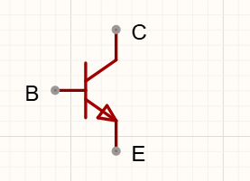
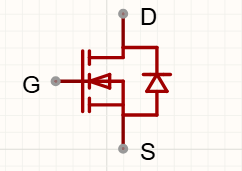
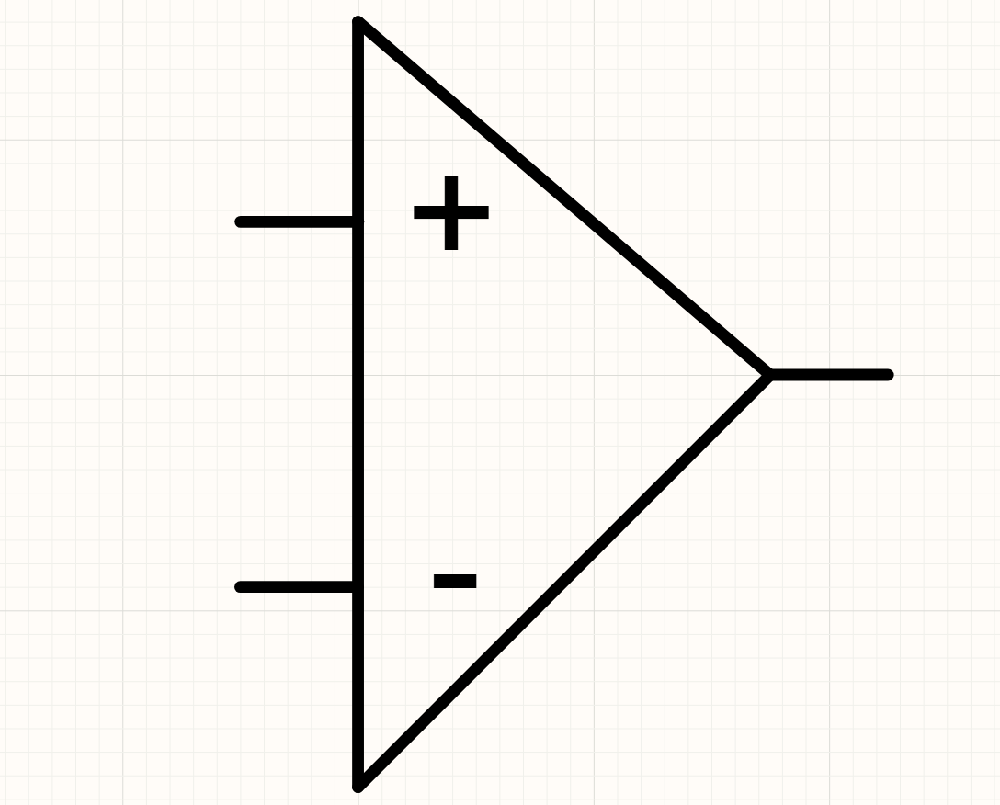
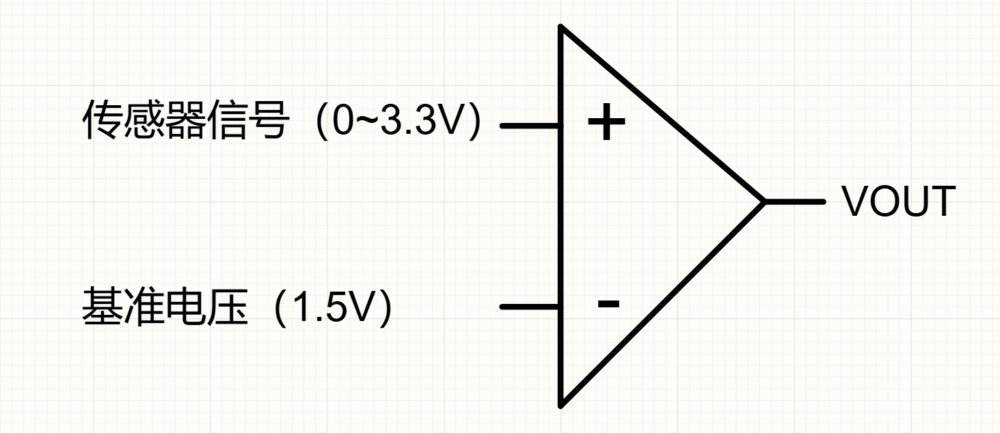
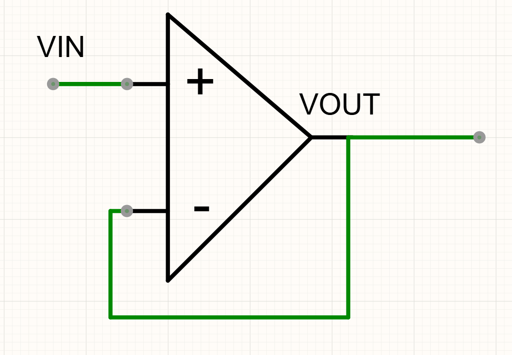

# Day 1 — 基础知识补充

> 在正式开始画电源管理模块之前，先补几块"地基"——搞懂电压电流是怎么回事、电容电感干什么用、PWM和闭环控制是什么。这些知识后面天天用。

---

## 1. 欧姆定律 — 电学界的 F=ma

**U = I × R**（电压 = 电流 × 电阻）

| 符号 | 叫什么 | 单位 | 通俗理解 |
|:---:|:------|:----:|---------|
| **U** | 电压 | 伏特(V) | 水压——推着电流走的力量 |
| **I** | 电流 | 安培(A) | 水流——单位时间流过的电荷量 |
| **R** | 电阻 | 欧姆(Ω) | 水管粗细——阻力越大电流越小 |

**三个变形**：
- 知道电压和电阻求电流：**I = U ÷ R**
- 知道电流和电阻求电压：**U = I × R**
- 知道电压和电流求电阻：**R = U ÷ I**

```
         U（电压·水压）
         ┌───┐
         │   │
   I·R  │ U │  U = I × R
         │   │
    I（电流·水流）┴ R（电阻·水管粗细）
          ─────
        欧姆定律三角：遮住要求的量，剩下两个就是公式
               ┌─────┐
               │  U  │         U
          I × R│ = ? │  →  I = ─
               └─────┘         R
```

**水管类比图：**

```
       ← 水压高（电压大）→       ← 水压低（电压小）→
    ┌──────┐                  ┌──────┐
    ║水箱  ║                  ║水箱  ║
    ║      ║   ┌──────┐      ║  ──  ║   ┌──────┐
    ║  ██  ║───┤水管  ├───→  ║      ║───┤水管  ├───→
    ║  ██  ║   │      │      ║      ║   │      │
    └──────┘   └──────┘      └──────┘   └──────┘
   水压大 → 水流大           水压小 → 水流小
         ← 管子细（电阻大）→       ← 管子粗（电阻小）→
    ┌──────┐                  ┌──────┐
    ║      ║   ┌──┐          ║      ║   ┌══════┐
    ║水箱  ║───┤║║├───→     ║水箱  ║───┤══════├───→
    ║      ║   └──┘          ║      ║   └══════┘
    └──────┘                  └──────┘
   管细→水流小（电流小）      管粗→水流大（电流大）
```

> **举个栗子**：一个LED需要3.3V、20mA，你有一个5V电源，需要串多大电阻？
> R = (5-3.3) ÷ 0.02 = 1.7 ÷ 0.02 = **85Ω**（选标称值82Ω或100Ω）

---

## 2. 功率 — 电做了多少功

**P = U × I**（功率 = 电压 × 电流），单位是瓦特(W)

**通俗理解**：功率就是"单位时间消耗了多少能量"。100W的灯泡比10W的亮，因为每秒消耗的能量多10倍。

**在电源设计中的意义**：功率 = **发热量**。一个元件上消耗1W功率，就是1W的热量在它上面散发。5W→手指贴上去就烫得拿不住了。

> **举个栗子**：5V→3.3V的LDO，输出500mA，发热多少？
> P = (5-3.3) × 0.5 = 0.85W → 芯片会很烫，需要散热

---

## 3. 电容 — 储电的水桶

电容就是**储存电荷的元件**。

```
  ───┤├───     ← 电容的电路符号
```

**类比理解**：电容像一个**小水桶**——
- **充电** = 往水桶里装水（装电荷）
- **放电** = 把水桶里的水倒出来（释放电荷）
- **容量** = 水桶能装多少水，单位**法拉(F)**，常用**μF**（微法，百万分之一法拉）

**电容的核芯性质**：**两端电压不能突变。** 这个特性让它能"抚平"电压波动。

```
电容充放电曲线（电压随时间变化）：
U
│
│              ──────────  → 充满后电压稳定
│            ╱
│          ╱               ← 充电时电压逐渐上升
│        ╱
│      ╱
│    ╱
│  ╱
└────────────────── t
        充电过程

电容滤波效果（把"锯齿"变"直线"）：
  整流后（没电容）       加了电容后
  ┌────┐  ┌────┐       ──────────────
  │    │  │    │       │
  │    │  │    │       │  平滑了
 ─┘    └──┘    └──    ─┘
  电压跳来跳去          电压稳如直线
```

**在电源电路中的两个作用**：

| 作用 | 解释 | 生活中的类比 |
|:----|------|-------------|
| **滤波** | 把脉动的电压变平滑 | **坐车过减速带：没电容 = 没减震的板车，过减速带颠到飞起（电压跳来跳去）；加了电容 = 装了减震的小汽车，过减速带只晃一下（电压平滑了）。电容就是电路里的"减震器"。** |
| **储能** | 电路突然需要大电流时，电容先顶上 | 跑步时突然加速，先深吸一口气 |

---

## 4. 电感 — 有惯性的水流

电感是一个**绕成线圈的导线**。

```
  ───○○○○───     ← 电感的电路符号
```

**类比理解**：电感像水流中的**水轮机（飞轮）**——

| 水流情况 | 水轮机的反应 | 电感对应的反应 |
|----------|-------------|---------------|
| 水流突然变大 | 水轮机转速上升，**阻止水流变大** | 电流增大时，电感产生反向电压**阻止电流增大** |
| 水流突然变小 | 水轮机释放惯性，**维持水流** | 电流减小时，电感释放磁场能量**维持电流** |

```
电感电流变化图：
I
│
│        ┌──── 稳定后电流不变
│       ╱│
│      ╱ │        ← 开关断开时电流逐渐下降
│     ╱  │
│    ╱   │   ────
│   ╱    │  ╱
│  ╱     │ ╱
│ ╱      │╱
└────────────────── t
  Ton     Toff
  ↑开关通   ↑开关断
  电流上升   电流下降（但没断！因为有电感惯性）
```

**电感的核芯性质**：**电流不能突变。** 这就是Buck开关电源用它来做电压转换的原因。

---

## 5. PWM — 快速开关

PWM = Pulse Width Modulation（脉冲宽度调制），中文叫**脉宽调制**。

### 用图形理解

先看一个最简单的方波信号，它在高电平和低电平之间来回跳变：

```
电压
↑
5V ──┐    ┌────┐    ┌────┐    ┌────
     │    │    │    │    │    │
0V ──┴────┘    └────┘    └────┘    └──→ 时间
     ↑             ↑
  高电平        低电平
（导通）       （关断）
```

PWM的核心思想是：**用"开多久、关多久"的比例（占空比）来控制平均输出。**

### 什么是占空比？——看三个具体例子

假设你有一个12V的灯泡，用PWM控制它的亮度：

```
① 占空比 = 25%
   高电平 ┌──┐    ┌──┐    ┌──┐
          │  │    │  │    │  │
   低电平 ─┘  └────┘  └────┘  └───
           ↑¼时间开，¾时间关
   平均电压 = 12V × 25% = 3V → 灯泡微亮

② 占空比 = 50%
   高电平 ┌────┐    ┌────┐    ┌────
          │    │    │    │    │
   低电平 ─┘    └────┘    └────┘    
          ½时间开，½时间关
   平均电压 = 12V × 50% = 6V → 灯泡半亮

③ 占空比 = 75%
   高电平 ┌──────┐  ┌──────┐  ┌──────
          │      │  │      │  │
   低电平 ─┘      └──┘      └──┘
          ¾时间开，¼时间关
   平均电压 = 12V × 75% = 9V → 灯泡很亮
```

### 两个关键参数

| 参数 | 定义 | 单位 | 通俗理解 |
|:----|:-----|:----:|---------|
| **频率 f** | f = 1/T，每秒开关多少次 | Hz（赫兹） | 开关的快慢——频率越高，开关越快 |
| **占空比 D** | D = Ton ÷ T × 100% | %（百分比） | 开的时间占多大比例——比例越高，平均输出越大 |

### 生活中的类比

**PWM就像快速开关水龙头**（每秒开关很多次）：

| 占空比 | 水龙头怎么开关 | 桶里接到的水量 |
|:-----:|:--------------|:-------------:|
| 0% | 完全关死 | 没水 |
| 25% | 开¼时间、关¾时间 反复 | ¼桶 |
| **50%** | **开½时间、关½时间 反复** | **½桶** |
| 75% | 开¾时间、关¼时间 反复 | ¾桶 |
| **100%** | **完全打开** | **满桶** |

关键是人眼/耳朵感觉不到快速的开关——所以你看到的灯泡是"稳定地亮着"，只是亮度不同。频率要足够高（几百Hz以上），肉眼就看不到闪烁了。

### PWM在项目中的应用

```
DC-DC降压：Buck电路用PWM控制开关管
           占空比50% → Vout ≈ Vin × 50%
           占空比大 → Vout高；占空比小 → Vout低

电机调速：PWM频率1kHz，占空比从0→100%
           占空比0% → 电机不转
           占空比50% → 电机半速
           占空比100% → 电机全速
```

> **一句话总结**：PWM就是用高速开关的比例（占空比）来控制平均输出——开得久平均就高，开得短平均就低。

---

## 6. 开环 vs 闭环 — 蒙眼走路 vs 睁眼走路

这两个概念来自控制理论，但理解起来很简单：

| | 开环控制 | 闭环控制 |
|:---|:---------|:---------|
| **比喻** | 蒙着眼睛走路 | 睁着眼睛走路 |
| **怎么做** | 按预设指令执行，不管实际结果 | 不断检查实际结果，根据偏差调整 |
| **优点** | 简单、响应快 | 精确、抗干扰 |
| **缺点** | 走歪了不知道 | 复杂、可能振荡 |
| **电源的例子** | 固定占空比的开关（不稳压） | **LDO和DC-DC（有反馈，稳压）** |

**关键点**：LDO和DC-DC都是**闭环控制系统**——它们内部有一个"眼睛"（反馈电路）不断检查输出电压，高了调低、低了调高。

---

## 7. 为什么需要稳压？

| 场景 | 不稳压会怎样 |
|:----|:------------|
| **电池供电（7.4V）** | 满电8.4V→正常；用到7.0V→MCU不稳定；6.0V→MCU重启/舵机乱转 |
| **USB供电（5V）** | USB实际在4.5~5.5V波动，灰度传感器对电压敏感→数据不准 |
| **电机启动瞬间** | 电机启动电流很大，会把电源电压拉低→MCU复位 |

**稳压电路** = 给电子系统一个"不管外面怎么变，我这边岿然不动"的稳定电压。

**两种方案**：

| 方案 | 效率 | 噪声 | 适合 |
|:----|:----:|:----:|:-----|
| **LDO（线性稳压）** | 低（Vout÷Vin） | 极低 | 小电流、压差小、模拟电路 |
| **Buck（开关稳压）** | 高（~90%） | 有纹波 | 大电流、压差大、电池供电 |

**本项目的架构**：电池(7.4V) → **Buck(RT8289GSP)** → 5V(给舵机+MCU) → **LDO(662K)** → 3.3V(给传感器)

---

## 8. 三极管——"小电流控制大电流的开关"

### 三极管是什么？有多常见？

三极管（BJT，双极性晶体管）是**电子电路里最基础的"放大开关"**。手机、电脑、充电器、电源……几乎所有电子产品内部都有三极管或它的进化版（MOS管）。

它是一个**三只脚的器件**：用一个小电流（基极），去控制一个大电流（集电极→发射极）。

### 先记住三个脚的名字



*↑ NPN三极管符号：①集电极C ②基极B ③发射极E，箭头从基极指向发射极*

| 引脚 | 英文含义 | 通俗理解 | 在水龙头比喻中的角色 |
|:----|:---------|:---------|:------------------|
| **基极 B** | Base = 基础 | **控制端**，给一点点电流 | **你的手**——拧水龙头 |
| **集电极 C** | Collector = 收集 | **输入端**，大电流从这里进来 | **水管里的水**——等着流出来 |
| **发射极 E** | Emitter = 发射 | **输出端**，大电流从这里出去 | **出水口**——水从这里流走 |

### 用比喻彻底理解——"自动水龙头"

想象一个安装在厨房水槽下的**感应水龙头**：

```
         ┌──────── 供水管（接自来水总管道）
         │
         ▼
   ┌──────────┐
   │   水龙头   │ 
   │  (三极管)  │
   └────┬─────┘
        │
        ▼
     洗碗（水流出去）
```

但这个水龙头很特别——**它靠你用手指轻轻推一下阀门（基极加小电流），水龙头就会自动放出大水流（集电极大电流）。**

- **你手指的力** = **基极电流 I_B**（很小，几mA）
- **水龙头流出的水量** = **集电极电流 I_C**（很大，几百mA~几A）
- **水龙头的放大能力** = **放大倍数 β = I_C ÷ I_B**

> 一个普通三极管的β ≈ 100~300。这意味着：基极你给它 1mA，集电极就能流出 100~300mA——放大了100~300倍。

### 三极管的两个关键"脾气"

**脾气一：基极和发射极之间需要 0.7V 才能"唤醒"**

```
基极电压 < 0.5V → 三极管"睡着"了（截止）——没电流通过
基极电压 = 0.7V → 三极管"醒了"（开始导通）
基极电压 > 0.7V → 三极管"正常工作"
```

> 记住0.7V这个数字——很多电路故障排查的第一步就是"测基极电压够不够0.7V"。

**脾气二：基极不能无限地灌电流——需要串一个电阻！**

```
如果没有限流电阻：
  5V ──── B极（基极）
  
  基极的PN结像二极管，直接接5V → 电流过大 → 烧坏三极管！

正确做法：
  5V ──── [1kΩ电阻] ──── B极（基极）
  
  基极电流 = (5 - 0.7) ÷ 1000 = 4.3mA ← 安全范围
```

### 三种工作状态——"关、放大、全开"

| 状态 | 基极情况 | 电流情况 | 水龙头类比 | 用在什么地方 |
|:----|:---------|:---------|:----------|:------------|
| **① 截止区（关）** | I_B = 0，基极电压 < 0.5V | C到E不通，I_C = 0 | 水龙头**关死** | **数字电路开关"断开"** |
| **② 放大区（调）** | I_B 适中（1μA~几十μA） | I_C = β × I_B，电流可调 | 水龙头**半开**，水量随手指力度变 | **模拟电路放大信号** |
| **③ 饱和区（开）** | I_B 够大（几mA以上） | I_C 达到最大值，管子完全导通 | 水龙头**开到最大** | **数字电路开关"闭合"** |

> 在电源电路中，三极管主要工作在①和③——**完全断开**和**完全导通**（就像家里的电灯开关，要么开要么关，没有中间状态）。

### 实战：用三极管做一个LED开关

```
            5V
             │
          ┌──┴──┐
          │  LED │  ← 负载（要控制的器件）
          └──┬──┘
             │
          470Ω│  ← 限流电阻（保护LED）
             │
           C极
        ┌──┤
  GPIO ─┤ 1kΩ ── B极  ← 基极串联电阻（保护三极管）
        └──┤
           E极
             │
            GND
```

**工作过程：**
```
① GPIO输出 3.3V（高电平）：
   基极电流 I_B = (3.3 - 0.7) ÷ 1000 = 2.6mA
   三极管饱和导通 → C到E相当于导线 → LED亮 ✅

② GPIO输出 0V（低电平）：
   基极电流 I_B = 0
   三极管截止 → C到E断开 → LED灭 ❌
```

> 这和你第2天要学的「662K内部调整管」原理一模一样——只是662K用MOS管代替了三极管，但思路完全相同：小信号控制大电流。

### NPN和PNP——两种三极管

本教程只用了NPN型，但要知道还有PNP型：

| 类型 | 符号区别 | 导通条件 | 电流方向 |
|:----|:---------|:---------|:---------|
| **NPN** | 箭头朝外（E→） | B比E高0.7V | C→E |
| **PNP** | 箭头朝内（→E） | B比E低0.7V | E→C |

> 记住"箭头方向就是电流方向"——NPN箭头朝外，电流从C到E；PNP箭头朝内，电流从E到C。

---

## 9. MOS管——"电压控制的开关"

### MOS管是什么？和三极管有什么不同？

MOS管（MOSFET，金属氧化物半导体场效应管）是**三极管的升级版**，也是**现代电源芯片的核心**。

核心区别一句话：**三极管用电流控制电流（需要耗电），MOS管用电压控制电流（几乎不耗电）。**

```
          ┌─── 三极管 ───┐            ┌─── MOS管 ────┐
          │               │            │              │
          │  基极需要电流  │            │  栅极只需要电压 │
          │  I_B ≠ 0      │            │  I_G ≈ 0     │
          │               │            │              │
          └───────────────┘            └──────────────┘
```

### 三个脚的名字



*↑ N沟道MOS管符号：①漏极D ②栅极G ③源极S*

| 引脚 | 英文含义 | 通俗理解 | 和三极管对比 |
|:----|:---------|:---------|:-----------|
| **栅极 G** | Gate = 门 | **控制端**，给它加电压它就"开门" | 相当于基极B，但不取电流 |
| **漏极 D** | Drain = 排水 | **输入端**，电流从这里进来 | 相当于集电极C |
| **源极 S** | Source = 源头 | **输出端**，电流从这里出去 | 相当于发射极E |

### 用比喻彻底理解——"感应式水龙头"

MOS管像一个**商场门口的感应门**——你不需要推它，人靠近它就自动开：

```
          ┌─── 商场大门
          │
          ▼
   ┌──────────────┐
   │   感应门      │
   │  (MOS管)      │
   └──────┬───────┘
          │
          ▼
       人走进商场
```

- **你靠近门的动作** = **栅极电压 V_GS**（你不需要用力推——不需要电流）
- **门打开的程度** = **漏极电流 I_D**（从D流向S的电流大小）
- **门的感应灵敏度** = **阈值电压 V_TH**（一般 2~4V——低于这个值门不开）

> 关键区别在此：三极管（BJT）像**推拉门**——你要用力推（电流），门开多大取决于你用了多大力。MOS管像**感应门**——你只要靠近（加电压），门就自动开（导通），不需要用力（不取电流）。

### N沟道MOS管是如何工作的？

```
① 栅极电压不够（V_GS < V_TH）→ 没有电场 → 门关着 → 不通电
   
   G ── 0V ──┐
              │     D ──╲   S  → 就像一堵墙挡着，电流过不去
              └ 没有"感应"

② 栅极电压够了（V_GS > V_TH）→ 产生电场 → 门打开 → 导通
   
   G ── 5V ──┐
              │     D ──╱   S  → 墙中间开了一条通道，电流可以过
              └ 产生"感应"
```

### MOS管的三种状态

| 状态 | 栅极电压 | 效果 | 感应门类比 |
|:----|:---------|:-----|:----------|
| **① 截止（关）** | V_GS < V_TH（如0V） | D到S不通，电阻∞ | 门关着，没人能进 |
| **② 可变电阻区（部分导通）** | V_GS > V_TH 但V_DS很小 | MOS管像一个电阻，R_DS由V_GS控制 | 门半开，宽度受控制 |
| **③ 完全导通（开关）** | V_GS >> V_TH 且V_DS较大 | R_DS很小（几mΩ~几Ω），D到S像导线 | 门大开，随便进出 |

### MOS管 vs 三极管：到底强在哪？

| 对比项 | 三极管（BJT） | MOS管 | 谁赢了？ |
|:------|:------------|:------|:--------:|
| **控制方式** | 电流控制（要耗电） | **电压控制（几乎不耗电）** | **MOS管** ✅ |
| **控制端要多少电** | 基极需要几mA | 栅极只要电压，电流≈0 | **MOS管碾压** ✅ |
| **导通后的电阻** | V_CE(sat)≈0.2V（固定压降） | R_DS(on)可低至几mΩ | **MOS管** ✅（电流越大优势越明显） |
| **开关速度** | 较快 | **非常快** | **MOS管** ✅ |
| **成本** | 很便宜 | 略贵 | 三极管 ✅ |
| **新手友好度** | 好理解，好计算 | 要注意栅极电压别超±20V | 三极管 ✅ |

> **结论**：小功率开关（< 100mA）用三极管便宜好焊；大功率/高效率（电源电路）**必须用MOS管**。

### 为什么电源芯片都用MOS管？（重要！）

662K内部调整管是**PMOS管**，RT8289GSP内部开关管也是**MOS管**。为什么？

**用一个具体计算说明：**

```
Buck电路输出 5V / 3A，开关管导通时：

用MOS管（R_DS(on)=100mΩ）：
  导通压降 = 3A × 0.1Ω = 0.3V
  损耗功率 = 0.3V × 3A = 0.9W
  效率影响 ≈ 很小（0.9W ÷ 15W总功率 ≈ 6%）

用三极管（V_CE(sat)=0.5V）：
  导通压降 = 0.5V（固定）
  损耗功率 = 0.5V × 3A = 1.5W
  效率影响 ≈ 大（1.5W ÷ 15W ≈ 10%）
```

同样的3A电流，MOS管比三极管少浪费0.6W——**对于电池供电的巡线小车来说，这0.6W意味着电池多跑10分钟。**

### N沟道 vs P沟道

本教程两个芯片分别用了PMOS（662K）和NMOS（RT8289GSP内部）：

| 类型 | 导通条件 | 符号箭头 | 常见用途 |
|:----|:---------|:---------|:---------|
| **N沟道（NMOS）** | 栅极比源极高（V_GS > V_TH） | 箭头朝外 | 开关管（Buck电路下管） |
| **P沟道（PMOS）** | 栅极比源极低（V_GS < -V_TH） | 箭头朝内 | **LDO调整管（662K内部）** |

> 你不需要记住N和P的所有细节——只要知道：662K内部是P沟道，RT8289GSP内部是N沟道。它们的**导通逻辑相反**，但作用一样：做开关。

---

## 10. 运算放大器——"会算数的放大器"

### 运放是什么？——一个"超级敏感的比较器"

运算放大器（简称**运放**，Op-Amp）是模拟电路里**最基础的"万能积木"**。它只有三个关键引脚：



*↑ 运算放大器符号：V+（同相输入）、V-（反相输入）、Vout（输出）*

| 引脚 | 名称 | 通俗理解 |
|:----|:-----|:---------|
| **V+（同相输入）** | 正输入端 | "老大"，它说啥就是啥 |
| **V-（反相输入）** | 负输入端 | "老二"，和老大对着干 |
| **Vout（输出）** | 输出端 | 听老大的话，和老二反着来 |

### 用最简单的比喻理解

运放就像一个**"偏心的裁判"**：

```
┌─────────────────────────────────────┐
│        🧑‍⚖️ 裁判（运放）              │
│                                     │
│  左边选手 V+ ──→ 裁判看他            │
│  右边选手 V- ──→ 裁判也看他          │
│                                     │
│  如果 V+ > V-：裁判大喊"左边赢！"     │
│              → 输出 = 高电平（接近电源）│
│                                     │
│  如果 V+ < V-：裁判大喊"右边赢！"     │
│              → 输出 = 低电平（接近GND）│
└─────────────────────────────────────┘
```

**运放的"超能力"**：它非常非常敏感！V+和V-只要相差 0.0001V，输出就能从0V直接跳到5V（或从5V掉到0V）。它的增益高达10万~100万倍。

### 运放的三个"脾气"（记住这三个就行）

```
脾气①：输入引脚几乎不取电流
   V+和V-的输入阻抗极高（几百万Ω），所以它们几乎不消耗电流。
   → 你不用担心运放会"偷走"前级电路的电流。

脾气②：闭环时两个输入端的电压会相等
   当运放的输出通过某种方式"告诉"V-它做了什么时，V+会自动等于V-。
   → 这叫"虚短"——假装短路，其实没短路。

脾气③：输出会尽全力让V+ = V-成立
   这就是脾气的核心——运放的一切行为都是为了"让V+和V-的电压相等"。
```

> 这三个脾气是理解所有运放电路的关键——**运放本身不聪明，它只会做一件事：让V+ = V-**。

### 用法一：比较器（判断谁大谁小）——最直观

最简单的用法：**不接反馈，直接用。**



*↑ 比较器电路：V+接传感器信号，V-接基准电压，输出为高或低*

结果：
  传感器 > 1.5V → Vout = 3.3V（高电平，检测到目标）
  传感器 < 1.5V → Vout = 0V（低电平，没检测到）
```

**我们在项目3（灰度传感器）中就用到了这个原理：**

```
灰度传感器比较器电路（LM393）：

红外接收管电压 ──→ V+
                     → 比较 → 输出"黑线/白线"信号
电位器设定阈值 ───→ V-


### 用法二：电压跟随器（缓冲隔离）——"复制电压，不取电流"

如果把输出直接接到V-输入端（这叫**负反馈**），运放就变成了"电压复制器"：



*↑ 电压跟随器：输出接回V-（负反馈），Vout = Vin*

**为什么需要这个？**


没有电压跟随器：
  传感器（输出能力弱）── 直接接 ── 负载（需要大电流）
  传感器的电压被负载"拉低"了 → 测量不准 ❌

加了电压跟随器：
  传感器 ── 运放V+（不取电流）── 运放输出（能驱动负载）
  传感器的电压没被影响 → 测量准确 ✅
```

### 运放662K内部怎么工作的？

662K内部的**误差放大器**就是一个运放，它的任务就是"让FB和基准电压相等"：

```
  FB电压（Vout的分压值）──┬── V+
                           │
                           ├──→ 控制PMOS调整管
  1.2V基准电压 ────────────┴── V-
```

**工作过程（和电压跟随器一模一样！）：**

① 如果Vout太高 → FB > 1.2V → V+ > V- → 运放输出变高
   → PMOS关小一点 → Vout降回来 → FB回到1.2V ✅

② 如果Vout太低 → FB < 1.2V → V+ < V- → 运放输出变低
   → PMOS开大一点 → Vout升回来 → FB回到1.2V ✅
```

> 运放让FB和1.2V基准始终相等——这就是**闭环控制**。你学到的"运放"知识，在662K内部直接就在用！

### 一句话总结

> **运放 = 一个会"自己矫正"的高倍放大器。给它两个输入，它会拼命让它们相等——这就是反馈控制的核心。**

---

## 📚 知识拓展——课后自主阅读

> 以下内容本项目中用不到，但了解它们能帮你更全面地理解电子电路。有兴趣可以看看。

### PNP型三极管——和NPN"反着来"

NPN三极管的箭头朝外（发射极→），PNP则箭头朝内（←发射极）。它们的导通条件也正好相反：

| 对比 | NPN（本项目用到） | PNP（拓展） |
|:----|:----------------|:-----------|
| 符号箭头 | 朝外（E→） | 朝内（→E） |
| 导通条件 | B比E **高** 0.7V | B比E **低** 0.7V |
| 电流方向 | C→E | E→C |
| 常见用途 | 低端开关（负载接电源侧） | 高端开关（负载接地侧） |

PNP管在662K内部没有用到，但在一些需要"高边开关"的场景（如电池保护电路）中很常见。

### PMOS管——P沟道MOSFET

NMOS（N沟道）需要V_GS > V_TH才导通，而**PMOS（P沟道）需要V_GS < -V_TH**才导通（栅极比源极低）。

本项目中662K内部的调整管就是**PMOS管**：

```
为什么662K用PMOS？
因为662K的输入是5V，输出是3.3V。
如果用NMOS：栅极要比源极高V_TH → 需要 > 5+2 = 7V → 662K没有更高的电压可用 ❌
如果用PMOS：栅极要比源极低V_TH → 只需要 < 5-2 = 3V → 误差放大器输出3V就能控制 ✅
```

> PMOS管在LDO中很常见，因为它的导通条件适合"输入高、输出低"的应用场景。

---

## 🧩 拓展延伸 — 小故事

### ⚡ 欧姆的悲剧人生

我们今天张嘴就来的"U=IR"，在1827年刚被提出时，学术界根本没人买账。

**格奥尔格·欧姆**（Georg Ohm）是一个德国中学老师，课余时间自己搭实验证明"电压和电流成正比"。他用不同长度的金属线做实验，发现长度增加一倍，电流减少一半——放到今天就是初中物理的水平。

但当时的主流学界认为"电"是不可测量的神秘力量，欧姆的论文被嘲笑为"纯属臆想"。他被迫辞去教职，在贫困中度过了近十年，直到1841年才被英国皇家学会追认——**那时候他已经完全秃顶了，而他的公式已经成为电工学的基础**。

> 这个故事告诉我们：你学的一个简单公式，背后可能是某个人一生的坚持。

### 🫙 莱顿瓶——最早的电容

1745年，荷兰莱顿大学的物理学家**马森布洛克**（Pieter van Musschenbroek）做了一个实验：把一个带电的铁钉放进装水的玻璃瓶里，想看看水能不能导电。

当他一手握着瓶子、另一只手去碰铁钉时——**他被狠狠地电了一下！** 他写信给法国同行说："就算是法国国王来了，我也不会再试第二次。"

但他意外发明了人类历史上第一个电容——**莱顿瓶**。一个玻璃瓶内外贴锡箔，中间玻璃做绝缘，就构成了一个最原始的电容。后来科学家发现它能储存电荷好几天——这在18世纪是不可想象的。

> 今天你焊在板子上的那个0603 MLCC（多层陶瓷电容），里面的原理和250年前的莱顿瓶一模一样——两个导体中间夹绝缘层。

### 🐸 青蛙腿引发的电池革命

1780年，意大利解剖学家**伽伐尼**（Luigi Galvani）在实验室发现：用铜钩和铁杆同时碰触死青蛙的腿，蛙腿会抽搐。他认为是"动物电"。

但另一位意大利人**伏打**（Alessandro Volta）不同意——他证明蛙腿抽搐是因为**两种不同金属在电解质（青蛙体液）中产生了电流**，刺激了神经。

伏打用这个原理在1800年发明了**伏打电堆**——用铜片和锌片交替叠放，中间夹盐水浸湿的布——这就是人类历史上第一个电池！

> 一个误解（"动物电"）催生了另一个正确的发现（伏打电堆）。今天我们用的锂电池、稳压电路，源头都能追溯到这只死青蛙。
