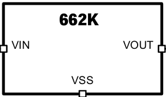
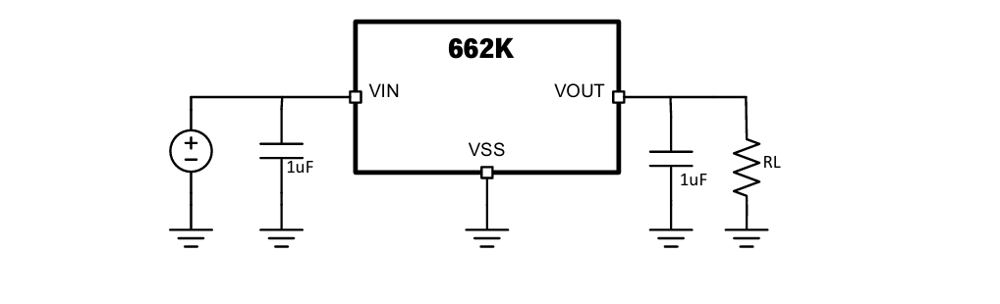

# 元件档案 · 662K — 3.3V低压差线性稳压器（LDO）

> **一句话认识它**：一颗只有三只脚、比米粒还小、花8分钱就能买到的3.3V稳压芯片。
> **封装**：SOT-23-3（三个引脚的小贴片，长得像三极管）
> **售价**：≈0.08元/颗（立创商城）

---

## 1. 长什么样？

### 外观与引脚定义

*↑ 662K SOT-23-3封装引脚排列：①GND ②Vout ③Vin，丝印写"662K"*

**引脚说明（记住这个顺序！）**

| 引脚 | 名称 | 功能 | 在电路中接什么 |
|:----:|:----:|------|----------------|
| **①** | **GND** | 接地——0V参考点 | 接GND（大面积铺铜） |
| **②** | **Vout** | **3.3V稳压输出** | 接负载（传感器/MCU等） |
| **③** | **Vin** | 电源输入（**最高6.0V**） | 接5V（来自RT8289GSP的输出） |

> ⚠️ **重要**：引脚顺序是 **①GND ②Vout ③Vin**，不是③①①的顺序！焊之前一定要用万用表通断档确认。

---

## 2. 典型应用电路

### 2.1 完整电路（就这几个元件）

*↑ 662K典型电路：输入5V加1μF电容 → 662K稳压 → 输出3.3V加1μF电容*

**就这么多——输入一个电容、输出一个电容。**

### 2.2 元件说明

| 元件 | 规格 | 作用 | 为什么是这个值 |
|------|------|------|--------------|
| **C1 (输入电容)** | 1μF MLCC 0603 | 防止输入电压抖动 | 662K内部已稳压，外部1μF足够 |
| **C2 (输出电容)** | 1μF MLCC 0603 | 让3.3V输出更平滑 | 传感器电流小(<100mA)，1μF够用 |

> 对比：如果你用AMS1117，需要10μF电解+100nF各两个（4个电容）。662K只用**2个0603小电容**——省地方、省成本。

---

## 3. 先认识AMS1117——LDO界的老大哥

在讲为什么选662K之前，先认识一下市面上最常见的LDO——**AMS1117**。

AMS1117几乎出现在每一块开发板上：Arduino、STM32最小系统板、ESP32开发板……你去淘宝搜"3.3V稳压模块"，出来的十有八九就是它。

**AMS1117主要参数：**
| 参数 | 值 |
|:----|:---:|
| 封装 | SOT-223（3脚+背面大散热焊盘） |
| 输入电压 | ≤ **15V** |
| 输出电压 | 3.3V固定（也有1.2/1.8/2.5/5.0/ADJ版本） |
| **最大输出电流** | **1A** |
| 静态电流 | ~**5mA** |
| 压差 | ~1V（输入至少比输出高1V） |
| 价格 | ~**0.3元** |
| 外围电路 | 10μF电解 + 100nF各两个（共4个电容） |

AMS1117的优点：**皮实、电流大、输入电压宽**。但它的静态电流5mA对电池供电设备不太友好。

### 3.1 那662K呢？

662K正是为了解决AMS1117的痛点而出现的——**更小、更省电、外围更简单**，当然代价是电流更小、输入电压更低。

| 对比 | AMS1117 | 662K |
|:----|:-------:|:----:|
| 封装 | SOT-223（和手指甲差不多） | **SOT-23-3（和米粒差不多）** |
| 外围元件 | 3个电容、2个电阻 | **2个电容** |
| 静态电流 | 5mA | **3μA** |
| 输出电流 | 1A | **300mA（够用）** |
| 输入电压 | ≤15V | **≤8.0V** |

### 3.2 为什么本项目选662K？

回到巡线小车的需求来看：
- 输入：**5V**（来自Buck输出）→ 662K最高6V，刚好能接 ✅
- 负载：**传感器总和 < 100mA** → 662K的250mA绰绰有余 ✅
- 供电：**电池供电** → 662K的25μA静态电流远优于AMS1117的5mA ✅
- 空间：**主板寸土寸金** → SOT-23-3是SOT-223的1/6大小 ✅

**结论**：在巡线小车传感器供电这个场景下，**662K是比AMS1117更优的选择。**

### 3.3 什么时候该用AMS1117？

| 场景 | 为什么用AMS1117 |
|:----|:---------------|
| **需要输出 > 250mA**（如驱动多个舵机） | 662K最大250mA，超了就过热保护 |
| **输入电压 > 6V**（如接12V电池） | 662K最高6V，接了会烧 |
| **焊接SOT-23-3有困难**（引脚太小） | SOT-223引脚大，好焊 |

---

## 4. 容易犯的错误

| ❌ 错误 | 后果 | ✅ 正确做法 |
|---------|------|------------|
| 把662K的Vin直接接>8V电池 | 芯片烧毁（最高8V！） | 必须接Buck的5V输出 |
| 引脚搞错（把Vin当Vss焊） | 不工作或烧芯片 | 焊前用万用表确认①=Vss ②=Vout ③=Vin |
| 省掉输入电容C1 | 输出电压抖动 | 必须焊C1（1μF），紧贴芯片 |
| 输出电流超过250mA | 芯片过热保护/输出电压下降 | 确认负载电流 ≤ 250mA |
| 把662K靠近电感放 | 输出噪声增大 | 662K尽量远离RT8289GSP的电感和SW区域 |

> 📖 **自主阅读训练**：尝试自己打开662K的数据手册（立创商城搜索"662K"即可下载PDF），找到以下信息：
> 1. 手册第几页给出了引脚定义？和本文件的描述一致吗？
> 2. 手册中给出的输出电压精度是多少？
> 3. 手册推荐的最小输入输出电容值是多少？
> 4. 手册中给出的静态电流（Iq）典型值是多少？
>
> 学会查阅数据手册是硬件工程师最基础也是最重要的能力——芯片的所有秘密都在那几页PDF里。

---

## 🧩 拓展延伸 — 小故事

### 👨‍🔬 线性稳压器的"教父"——Bob Widlar

如果你打开任何一个老式电源芯片的数据手册，很大概率会在设计者一栏看到同一个名字：**鲍勃·威德拉**（Bob Widlar）。

Widlar是模拟IC设计领域的传奇人物。1960年代，他在仙童半导体（Fairchild）设计了世界上第一款集成运放μA702，后来跳槽到国家半导体（National Semiconductor）。他有一个著名习性：**如果同事太吵影响他思考，他就把办公室的门拆下来当桌子用。**

1970年，Widlar设计了一款划时代的产品——**LM109**，五端稳压器。但更出名的是几年后的 **LM317**（可调三端稳压器），它的外围只需要两个电阻就能设定任意输出电压。LM317从1977年一直生产到今天——**47年不断供**，堪称芯片界的常青树。

> 662K的原理和LM317一样，只是封装更小、电流更小。你今天学的"可调电阻分压"思想，源头就来自Widlar在1970年代的一张草图。

### 💰 压差的故事——从1.5V到0.1V

早期的线性稳压器（如7805）有一个坑：**输入电压必须比输出高2~3V才能工作**。你要输出5V，至少得输入7V——多出来的2V就是压在芯片上的额外功耗。

这限制了电池供电设备的发展。一个4.2V的锂电池，根本没法用7805输出3.3V（输入不够高）。

1980年代，工程师们想了一个办法：把调整管从普通PNP三极管换成**PNP达林顿管**，再后来换成**PMOS管**——它们的导通压降可以做到0.1~0.4V。这种新型稳压器被称为 **LDO（Low Dropout，低压差）**。

> 662K的压差只有0.2V——这意味着你用5.0V输入就能输出稳定的3.3V，中间只浪费了0.2V×0.1A=0.02W。没有LDO的发明，今天你的手机根本撑不了半天。

### 🔢 为什么叫"662K"？

芯片上的丝印"662K"其实是一种**简化的标记代码**，因为SOT-23-3封装太小了，印不下完整的型号。

662K真正的芯片型号通常是 **XC6206P332MR**（或类似），由日本Torex公司设计。其中：
- **"332"** 表示输出电压3.3V（如果是"182"就是1.8V，"502"就是5.0V）
- 前面的数字是产品系列编号

立创商城里卖8分钱一个的"662K"，和原装Torex XC6206P332的核心设计基本一致，来源是国内晶圆厂流片生产的兼容版本。

> 这就是中国制造的魅力：8分钱一个，性能够用，让每个电子爱好者都能轻松做出一块自己的电源板。
