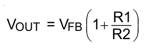
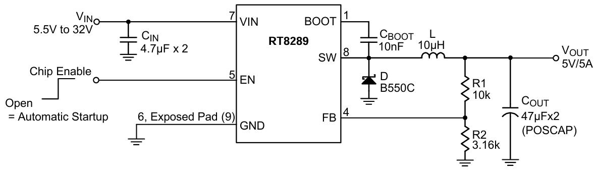
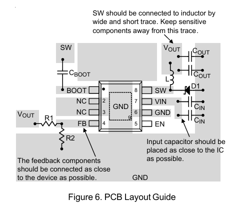

# 元件档案 · RT8289GSP — 降压开关稳压器（Buck）

> **一句话认识它**：一颗8只脚的电源芯片，来自立锜科技（Richtek），用500kHz开关频率高效降压。带5A大电流，内部自带补偿和软启动——外围元件非常少。
> **封装**：SOP-8 EP（8个引脚 + 底部大散热焊盘）
> **售价**：≈2.85元/颗（立创商城，Richtek原装）
> **核心数据**：输入5.5~32V → 可调输出（本项目设5V），最大5A，效率~90%

---

## 1. 长什么样？

### 外观与引脚定义


*↑ RT8289GSP SOP-8 EP封装引脚排列：①BOOT ②NC ③NC ④FB ⑤EN ⑥GND ⑦VIN ⑧SW，底部散热焊盘必须焊接到GND*


### 各引脚详细说明

| 引脚 | 名称 | 功能 |
|:----:|:----:|------|
| **①** | **BOOT** | 高边栅极驱动自举输入。BOOT为高边N-MOSFET开关提供驱动信号。从SW到BOOT连接一个10nF或更大的电容，以供电流高边开关。 |
| **②** | **NC** | 无内部连接。 |
| **③** | **NC** | 无内部连接。 |
| **④** | **FB** | 反馈输入。FB感应输出电压以调节该电压。用从输出电压引出的电阻性分压器驱动FB。分压器电阻值同时也决定了环路带宽。反馈阈值设定为1.222V。（内部基准**1.222V**） |
| **⑤** | **EN** | 芯片使能（高态有效）。EN是一种数字输入信号，用于开启或关闭调节器。将EN驱动至高于1.4V即可开启调节器，低于0.4V则将其关闭。如需实现自动启动，请断开EN的连接。 |
| **⑥** | **GND** | 接地。暴露的焊盘必须焊接到大尺寸PCB上，并连接至GND以实现最大功率耗散。 |
| **⑦** | **VIN** | 电源输入。VIN为IC以及降压转换器开关提供电力。使用5.55V至32V的电源驱动VIN。通过适当的大型电容器将VIN旁路至地线，以消除对IC输入端的噪声影响。|
| **⑧** | **SW** | 电源切换输出。SW是负责为输出端提供电力的切换节点。将输出LC滤波器从SW连接到输出负载端。请注意，从SW到BOOT处需接入一个电容，以给高侧开关供电。|
> 💡 **设计亮点**：RT8289GSP把补偿网络和软启动都集成到了芯片内部，省去了外部COMP和SS电容——比其他Buck芯片少两个外围元件。

---

## 2. 输出电压怎么计算

### 反馈环路怎么算输出电压？

FB引脚反馈参考电压值为1.222V



*↑ FB引脚通过R1/R2分压检测输出电压，与内部1.222V基准比较后调节占空比*


## 3. 核心参数

| 参数 | 值 | 说明 |
|------|:---:|------|
| **输入电压范围** | **5.5~32V** | 覆盖2S(7.4V)~7S(25.9V)锂电池 |
| **输出电压范围** | **1.222~26V** | 通过反馈电阻可调 |
| **最大输出电流** | **5A** | 输出能力强劲 |
| **开关频率** | **500kHz** | 开关损耗低，效率高 |
| **反馈基准电压** | **1.222V** | FB引脚的目标电压 |
| **内部MOS导通电阻** | 100mΩ | 导通损耗小 |
| **静态电流** | 0.8mA | |
| **关断电流** | 25μA | EN拉低时几乎不耗电 |
| **效率** | **~90%**（5V/3A时） | |
| **补偿** | **内部补偿** | 无需外部COMP网络 ✅ |
| **软启动** | **内部软启动** | 无需外部SS电容 ✅ |
| **封装** | SOP-8 EP | 底部散热焊盘 |

---

## 4. 典型应用电路

### 4.1 工作原理简述

RT8289GSP是一个**Buck降压转换器**，核心工作分为两步：

```
① 开关管导通（Ton）：输入电流 → 内部MOS管导通 → 流过电感L1
   电感储存磁场能量，电流逐渐上升，同时给输出电容C3/C4充电
   
② 开关管关断（Toff）：内部MOS管断开
   电感靠惯性继续推电流，电流路径：GND → 续流二极管D1 → 电感L1 → 输出
   电感释放磁场能量，电流逐渐下降
```

这个过程以 **500kHz**（每秒50万次）的速度重复，电感+输出电容把脉冲电流"抚平"成稳定的5V直流输出。FB引脚检测输出电压，与内部1.222V基准比较，自动调节开关的占空比——这就是**闭环控制**。

### 4.2 完整电路（本项目5V输出）



*↑ RT8289GSP 典型运用电路*


### 4.3 输出电压设定——反馈电阻计算

RT8289GSP的内部基准电压是 **1.222V**。

```
Vout = 1.222 × (1 + R1/R2)

R1 = 上分压电阻（FB到Vout）
R2 = 下分压电阻（FB到GND）
```

**算一算：要输出5V**

选R1=10kΩ（一个常见值）：
```
R2 = 10k ÷ (5/1.222 - 1) = 10k ÷ (4.09 - 1) = 10k ÷ 3.09 ≈ 3.23kΩ
可以搭建R2 = 2.2kΩ ＋ 1kΩ

Vout = 1.222 × (1 + 10/3.2) = 1.222 × 4.125 = 5.04V → 误差<2% ✅
```


### 4.4 完整BOM清单

| 序号 | 参数/型号 | 封装 | 数量 | 备注 |
|------|----------|------|:---:|------|
| 1 | **RT8289GSP** | SOIC-8 (EP) | 1 | Richtek原装 |
| 2 | **SS54** 肖特基二极管 | SMA | 1 | **电压:40V 电流:5A** 注意极性 |
| 3 | 功率电感 | SMD | 1 | 电流≥5A |
| 4 | 4.7μF 50V  | C1206 | 2 | 输入电容 |
| 5 | 47μF 35V | CAP-SMD | 2 | 输出电容 |
| 6 | 10nF (104) 50V | 0603 | 1 | **给内部MOS管做驱动（CBOOT）** |
| 7 | **10kΩ** | 0603 | 1 | 反馈上分压 |
| 8 | 3.2kΩ | 0603 | 1 | 反馈下分压 |

---


## 5. PCB布局小技巧——留意电流的回流路径

> ⚡ 画PCB时，很多人只盯着"从哪儿到哪儿"的走线，却忽略了电流怎么**回来**——回流路径和信号路径同样重要。

### 为什么回流路径很重要？

任何电路中的电流都是**一个完整的回路**：从电源正极出发，经过元件，最后回到电源负极。回流路径没设计好会出现三个问题：

| 问题 | 后果 |
|:----|:------|
| **回路面积大** | 产生电磁辐射（EMI），干扰板上其他电路 |
| **回流和信号走线不平行** | 产生额外的寄生电感，导致电压尖峰 |
| **不同回路共用一段地线** | 产生"地弹"——大电流的回流干扰小信号地电位 |

### Buck电路的两个关键回流路径

```
回路
Vin → C1/C2 → RT8289GSP的IN → 内部开关管 → SW → L1 → COUT → 反馈负载 → GND → 回COUT
 ↕ 这个回路面积要尽量小！

```
### 三条实操建议


① 输入输出电容C1/C2的GND焊盘 → 打多个过孔到底层GND铺铜 → 让回流路径最短
② FB反馈电阻尽量靠近芯片





---

## 🧩 拓展延伸 — 小故事

### 🇹🇼 立锜科技——台湾的电源芯片传奇

RT8289GSP的生产商 **立锜科技（Richtek）**，1998年成立于台湾新竹科学园区。

在2000年代，电源芯片市场几乎被美商垄断——MPS（美国）、Linear Tech（美国）、TI（美国）。立锜的策略很务实：**做和美商兼容、但更便宜、交货更快的替代方案。**

他们的RT系列Buck芯片以高性价比著称，RT8289GSP就是其中的代表——性能可靠，价格却只要2.85元。

今天立锜已经是全球最大的模拟IC公司之一，年营收超过百亿新台币。

> 如果说MPS是"电源芯片界的宝马"——性能好、价格高，那立锜就是"丰田"——皮实耐用、性价比极高。RT8289GSP就是丰田卡罗拉级别的电源芯片。

### 🔄 为什么内部补偿是好事？

RT8289GSP把补偿网络集成到芯片内部，省去了外部COMP元件。好处不仅仅是少焊两个元件：

```
少两个元件 → PCB空间省一点 → BOM物料少两项
           → 少两个失效点 → 可靠性更高
```

> **一句话**：内部补偿 ≈ 设计更省心。

### 📏 500kHz频率的优势

RT8289GSP的开关频率是500kHz，这个频率兼顾了效率和布局友好性：

```
500kHz → 开关损耗低 → 效率高 ✅
       → 布局宽容度高 → 对新手友好 ✅
       → 需要22~33μH电感（适中大小）
```

> 频率越低，每个开关周期的时间越长，电感的充放电时间也越长——所以需要相对大一些的电感值，但好处是开关损耗低、布局要求没那么苛刻。

---

> **学习检查**：
> 1. RT8289GSP的①脚是什么？怎么接？
> 2. 它的Vref是多少？要输出5V，R1和R2怎么选？
> 3. 为什么它不需要外部COMP和SS电容？
> 4. RT8289GSP的频率、电感值、输出电流分别是多少？
