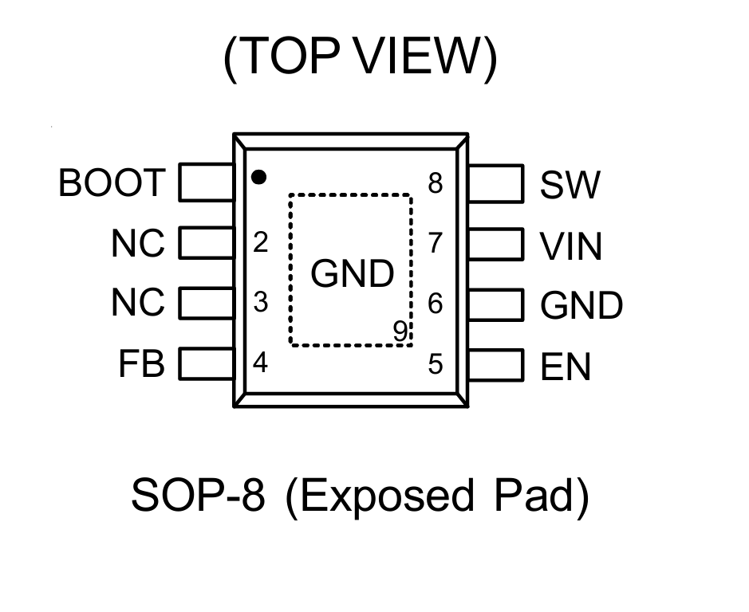

# 元件档案 · RT8289GSP — 降压开关稳压器（Buck）

> **一句话认识它**：一颗8只脚的电源芯片，来自立锜科技（Richtek），用500kHz开关频率高效降压。带5A大电流，内部自带补偿和软启动——外围元件比MP1584少一倍。
> **封装**：SOP-8 EP（8个引脚 + 底部大散热焊盘）
> **售价**：≈2.85元/颗（立创商城，Richtek原装）
> **核心数据**：输入5.5~32V → 可调输出（本项目设5V），最大5A，效率~90%

---

## 1. 长什么样？

### 外观与引脚定义



*↑ RT8289GSP SOP-8 EP封装引脚排列：①BOOT ②NC ③NC ④FB ⑤EN ⑥GND ⑦VIN ⑧SW，底部散热焊盘必须焊接到GND*


### 各引脚详细说明

| 引脚 | 名称 | 功能 |
|:----:|:----:|------|
| **①** | **BOOT** | 高边栅极驱动自举输入。BOOT为高边N-MOSFET开关提供驱动信号。从SW到BOOT连接一个10nF或更大的电容，以供电流高边开关。 |
| **②** | **NC** | 无内部连接。 |
| **③** | **NC** | 无内部连接。 |
| **④** | **FB** | 反馈输入。FB感应输出电压以调节该电压。用从输出电压引出的电阻性分压器驱动FB。分压器电阻值同时也决定了环路带宽。反馈阈值设定为1.222V。（内部基准**1.222V**） |
| **⑤** | **EN** | 芯片使能（高态有效）。EN是一种数字输入信号，用于开启或关闭调节器。将EN驱动至高于1.4V即可开启调节器，低于0.4V则将其关闭。如需实现自动启动，请断开EN的连接。 |
| **⑥** | **GND** | 接地。暴露的焊盘必须焊接到大尺寸PCB上，并连接至GND以实现最大功率耗散。 |
| **⑦** | **VIN** | 电源输入。VIN为IC以及降压转换器开关提供电力。使用5.55V至32V的电源驱动VIN。通过适当的大型电容器将VIN旁路至地线，以消除对IC输入端的噪声影响。|
| **⑧** | **SW** | 电源切换输出。SW是负责为输出端提供电力的切换节点。将输出LC滤波器从SW连接到输出负载端。请注意，从SW到BOOT处需接入一个电容，以给高侧开关供电。|
> 💡 **对比MP1584**：MP1584需要外部COMP补偿网络（R+C）和外部SS电容。**RT8289GSP把这两个都集成到芯片内部了**——省两个元件、省两处焊接、省一点板面空间。

---

## 2. 输出电压怎么计算

### 反馈环路怎么算输出电压？

FB引脚反馈参考电压值为1.222V


*↑ FB引脚通过R1/R2分压检测输出电压，与内部1.222V基准比较后调节占空比*


## 3. 核心参数

| 参数 | 值 | 说明 |
|------|:---:|------|
| **输入电压范围** | **5.5~32V** | 覆盖2S(7.4V)~7S(25.9V)锂电池 |
| **输出电压范围** | **1.222~26V** | 通过反馈电阻可调 |
| **最大输出电流** | **5A** | 比MP1584的3A大得多 |
| **开关频率** | **500kHz** | 比MP1584(1.5MHz)低，但开关损耗也低 |
| **反馈基准电压** | **1.222V** | FB引脚的目标电压（MP1584是0.8V） |
| **内部MOS导通电阻** | 100mΩ | 导通损耗小 |
| **静态电流** | 0.8mA | |
| **关断电流** | 25μA | EN拉低时几乎不耗电 |
| **效率** | **~90%**（5V/3A时） | |
| **补偿** | **内部补偿** | 无需外部COMP网络 ✅ |
| **软启动** | **内部软启动** | 无需外部SS电容 ✅ |
| **封装** | SOP-8 EP | 底部散热焊盘 |

---

## 4. 典型应用电路

### 4.1 完整电路（本项目5V输出）


*↑ RT8289GSP 5V输出完整电路：输入7~12V → 输出5V/3A，COMP和SS悬空（内部集成）*


| 元件 | 规格 | 数量 | 作用 | 为什么选这个值 |
|------|------|:----:|------|--------------|
| **CIN** | 4.7μF 32V MLCC 1206 | 2 | 滤除输入噪声+储能 | 并联→ESR减半→纹波更小 |
| **CBOOT** | 10nF 25V MLCC 0603 | 1 | 给内部高端MOS驱动供电 | **不能省！** |
| **L1 (功率电感)** | **22~33μH / 5A** | 1 | 储能+平滑电流 | 500kHz需更大电感 |
| **D1 (续流二极管)** | **SS54** 肖特基 (5A/40V) | 1 | 开关断开时提供续流路径 | 电流5A，比SS34大 |
| **C3, C4 (输出电容)** | 22μF 16V MLCC 1206 | 2 | 平滑输出电压 | |
| **R1 (反馈上分压)** | **31.6kΩ** 1% 0603 | 1 | 设定输出电压 | 用1.222V基准算出 |
| **R2 (反馈下分压)** | 10kΩ 1% 0603 | 1 | 设定输出电压 | |
| **R3 (EN上拉)** | 100kΩ 0603 | 1 | 拉高EN使芯片始终工作 | |

### 4.2 外围元件详解

| 元件 | 规格 | 数量 | 作用 | 为什么选这个值 |
|------|------|:----:|------|--------------|
| **C1, C2 (输入电容)** | 22μF 25V MLCC 1206 | 2 | 滤除输入噪声+储能 | 并联→ESR减半→纹波更小 |
| **Cbst (自举电容)** | 0.1μF 25V MLCC 0603 | 1 | 给内部高端MOS驱动供电 | **不能省！** |
| **L1 (功率电感)** | **22~33μH / 5A** | 1 | 储能+平滑电流 | 500kHz需更大电感 |
| **D1 (续流二极管)** | **SS54** 肖特基 (5A/40V) | 1 | 开关断开时提供续流路径 | 电流5A，比SS34大 |
| **C3, C4 (输出电容)** | 22μF 16V MLCC 1206 | 2 | 平滑输出电压 | |
| **R1 (反馈上分压)** | **31.6kΩ** 1% 0603 | 1 | 设定输出电压 | 用1.222V基准算出 |
| **R2 (反馈下分压)** | 10kΩ 1% 0603 | 1 | 设定输出电压 | |
| **R3 (EN上拉)** | 100kΩ 0603 | 1 | 拉高EN使芯片始终工作 | |

### 4.3 输出电压设定——反馈电阻计算

RT8289GSP的内部基准电压是 **1.222V**（不是MP1584的0.8V）。

```
Vout = 1.222 × (1 + R1/R2)

R1 = 上分压电阻（FB到Vout）
R2 = 下分压电阻（FB到GND）
```

**算一算：要输出5V**

选R2=10kΩ（一个常见值）：
```
R1 = (5/1.222 - 1) × 10k = (4.09 - 1) × 10k = 3.09 × 10k = 30.9kΩ
```

最接近的1%标称值是 **31.6kΩ**（或者30.9kΩ）：

```
用31.6kΩ：
Vout = 1.222 × (1 + 31.6/10) = 1.222 × 4.16 = 5.08V → 误差<2% ✅
```

> 💡 **注意**：因为基准从0.8V变成了1.222V，反馈分压比变了，所以R1的阻值和MP1584不一样。焊接时**不要搞混**！

### 4.4 电感选型

因为RT8289GSP的开关频率是**500kHz**（MP1584是1.5MHz），每个开关周期的时间更长，电感的充放电时间也变长了→需要更大的电感值来控制纹波。

| 输入电压 | 输出电压 | 推荐电感值 |
|---------|---------|-----------|
| 7~12V | 5V | **22~33μH** |
| 12~24V | 5V | 33~47μH |
| 7~12V | 3.3V | 15~22μH |

**饱和电流**：电感饱和电流 ≥ 输出电流 × 1.3
```
本项目输出3A → 饱和电流 ≥ 3.9A 
实际选 **22~33μH / 5A** → 余量充足 ✅
```

### 4.5 完整BOM清单

| 序号 | 元件 | 参数/型号 | 封装 | 数量 | 备注 |
|------|------|----------|------|:---:|------|
| **Buck部分** | | | | | |
| 1 | U1 | **RT8289GSP** | SOP-8 (EP) | 1 | Richtek原装 |
| 2 | D1 | **SS54** 肖特基二极管 | SMA (DO-214AC) | 1 | **5A！** 注意极性 |
| 3 | L1 | **22~33μH/5A** 功率电感 | CD75/CD105 | 1 | 电流≥5A |
| 4 | C1,C2 | 22μF 25V MLCC | 1206 | 2 | 输入电容 |
| 5 | C3,C4 | 22μF 16V MLCC | 1206 | 2 | 输出电容 |
| 6 | Cbst | 0.1μF (104) 25V MLCC | 0603 | 1 | **BST自举电容（必须接！）** |
| 7 | R1 | **31.6kΩ** 1% | 0603 | 1 | 反馈上分压 |
| 8 | R2 | 10kΩ 1% | 0603 | 1 | 反馈下分压 |
| 9 | R3 | 100kΩ | 0603 | 1 | EN上拉 |
| 10 | J1 | 接线端子 2P 5.08mm | 插件 | 1 | 输入接口 |
| 11 | J2 | 接线端子 2P 5.08mm | 插件 | 1 | 输出接口 |
| **LDO部分** | | | | | |
| 12 | U2 | 662K（3.3V固定输出） | SOT-23-3 | 1 | 5V→3.3V |
| 13 | C8 | 1μF 16V MLCC | 0603 | 1 | 662K输入电容 |
| 14 | C9 | 1μF 16V MLCC | 0603 | 1 | 662K输出电容 |
| 15 | J3 | 排针 2P 2.54mm | 插件 | 1 | 3.3V输出（可选） |

---

## 5. 开关电源PCB布局——四大铁律

> 和MP1584一样，RT8289GSP也是高频开关电源，PCB布局的四条铁律同样适用。

> 详见 `part4-DC-DC电源降压模块/day4-DC-DC降压电源模块.md` 第6节（布局铁律与RT8289GSP通用）

---

## 6. 走线宽度参考

| 走线 | 电流 | 线宽 |
|------|:----:|:----:|
| IN→输入电容→RT8289GSP的IN | ~3A（峰值更高） | **2~2.5mm** |
| SW→L1、SW→D1 | ~3A | **2mm短走线** |
| L1→输出电容→Vout | ~3A | **2~2.5mm** |
| FB分压走线 | <1mA | 0.25mm（细线，远离SW和电感） |
| EN走线 | 极小 | 0.3mm |
| GND | 回路电流 | **大面积铺铜** |

---

## 7. 焊接注意事项

- **与MP1584相同**：SOP-8 EP封装，底部散热焊盘焊接到GND
- **SS54二极管** 比SS34大，阴极（有横线端）接SW，阳极接GND
- 电感值22~33μH比MP1584的大，对应的CD75或CD105封装也稍大

---

## 8. 常见问题排查

| 现象 | 可能原因 | 先查什么 |
|------|---------|---------|
| 输出=0V | EN没拉高（<0.7V）/ 输入电容短路 / 输入<5.5V | 测EN脚电压（应>1.5V） |
| 输出=输入电压 | FB开路 → 芯片满占空比工作 | 测FB脚电压（应=1.222V） |
| 输出纹波巨大 | 输出电容太小 / 电感饱和 / 布局差 | 检查电感是否饱和 |
| 芯片上电就烧 | 输入电容离太远 / 输入电压超32V | 检查布局和输入电压 |
| 轻载正常、重载掉电压 | 电感饱和 / 续流二极管电流不够 | 换更大电流电感 |

---


## 🧩 拓展延伸 — 小故事

### 🇹🇼 立锜科技——台湾的电源芯片传奇

RT8289GSP的生产商 **立锜科技（Richtek）**，1998年成立于台湾新竹科学园区。

在2000年代，电源芯片市场几乎被美商垄断——MPS（美国）、Linear Tech（美国）、TI（美国）。立锜的策略很务实：**做和美商兼容、但更便宜、交货更快的替代方案。**

他们的RT系列Buck芯片（RT8289是其中之一）直接对标MPS的MP系列——功能相似，但价格只有MPS的1/3~1/5。MPS的MP1584卖14元，RT8289GSP只卖2.85元。

今天立锜已经是全球最大的模拟IC公司之一，年营收超过百亿新台币。

> 如果说MPS是"电源芯片界的宝马"——性能好、价格高，那立锜就是"丰田"——皮实耐用、性价比极高。RT8289GSP就是丰田卡罗拉级别的电源芯片。

### 🔄 为什么内部补偿是好事？

MP1584需要外部COMP补偿网络（R4+C7），RT8289GSP不需要。多两个元件看起来不多，但在实际生产中会带来连锁好处：

```
少两个元件 → 少两个贴片位 → 焊接点数少4个
           → PCB空间省一点 → 布局更宽松
           → BOM物料少两项 → 采购管理简单
           → 少两个失效点 → 可靠性更高
```

对于大规模生产，每个元件的成本不仅是物料本身，还有**仓储成本、贴片成本、检验成本、返修成本**。RT8289GSP把补偿网络集成到芯片内部，就是把"麻烦"留给了芯片设计工程师，把"省心"留给了使用芯片的你。

> **一句话**：内部补偿 ≈ 你少操一份心。

### 📏 从500kHz到1.5MHz——频率差异的取舍

RT8289GSP用500kHz，MP1584用1.5MHz。这3倍的频率差异带来什么影响？

```
           500kHz（RT8289GSP）       1.5MHz（MP1584）
周期时间：     2μs                       0.67μs
电感值：     22~33μH                    10~15μH
开关损耗：   较低 ✅                    较高
电感体积：   较大 ⚠️                    较小 ✅
对布局敏感度：较低 ✅                    较高 ⚠️
```

频率没有绝对的"好"或"坏"——它们是设计取舍：
- **高频**（1.5MHz）→ 电感小、布局敏感、开关损耗大
- **低频**（500kHz）→ 电感大、布局宽容、开关损耗小

RT8289GSP选择了500kHz这个"中间频率"——电感不算太大，布局也不算太难，对新手友好。

> **你正在学的是"取"和"舍"的思维**——以后选芯片时，除了看"能不能用"，还要看"频率多少、外围多少、好不好layout"。

---

> **学习检查**：
> 1. RT8289GSP的①脚是什么？怎么接？
> 2. 它的Vref是多少？要输出5V，R1和R2怎么选？
> 3. 为什么它不需要外部COMP和SS电容？
> 4. 它和MP1584比，频率、电感、电流三个主要差异是什么？
