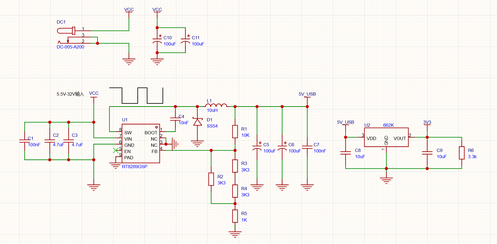

# Day 4 — 电源管理模块 · 综合实践

> **目标**：把Day 2（662K LDO）和Day 3（RT8289GSP Buck）的知识整合起来，完成完整的电源模块设计——从原理图到PCB到焊接测试。
> **在巡线小车中的角色**：电池(7.4V) → **RT8289GSP Buck** → 5V（给舵机+MCU）→ **662K LDO** → 3.3V（给传感器）

---

## 1. 整体供电架构

```
锂电池组（7.4V / 2S）
     │
     ▼
 ┌──────────────┐
 │ RT8289GSP    │ → 5V / 3A
 │ Buck降压      │    ├── 舵机供电（5V）
 └──────────────┘    ├── MCU供电（5V→板载LDO→3.3V）
     │               └── Buck输出→662K输入
     │ 5V
     ▼
 ┌──────────────┐
 │ 662K LDO     │ → 3.3V / 250mA → 灰度传感器、蓝牙等
 └──────────────┘
```

**为什么不用一级降压？**

```
一级7.4V→3.3V（只用LDO）:
  效率 = 3.3 ÷ 7.4 = 44.6% → 超过一半的电变成热量 ❌

两级7.4V→5V（Buck）→3.3V（LDO）:
  Buck效率≈90%，LDO效率=3.3÷5=66%
  综合效率 ≈ 90% × 66% = 59.4% → 好得多 ✅
```

> 每个芯片的详细原理见 `day1-基础知识的补充.md`（基础知识）和 `day2/day3`（芯片档案）。

---

## 2. 元件清单

### 输入部分

| 位号 | 元件 | 封装 | 数量 | 备注 |
|:-----|:-----|:-----|:----:|:-----|
| DC1 | DC-005-A200 | DC-IN-TH_DC | 1 | 输入端口 |
| C10、C11 | 电容| 100uF 35V SMD | 2 | 滤波 |

### Buck部分（RT8289GSP）

| 位号 | 元件 | 封装 | 数量 | 备注 |
|:-----|:-----|:-----|:----:|:-----|
| U1 | RT8289GSP | SOIC-8 | 1 | 主控Buck芯片 |
| D1 | SS54 | SMA | 1 | 续流二极管，阴极接SW |
| L1 | 电感 | 10μH / 5A | 1 | 功率电感 |
| C2, C3 | 输入电容 | 47μF 50V C1206 | 2 | 滤波 |
| C5、C6 | 输出电容 | 100μF 35V SMD | 2 | 滤波 |
| C1、C7 | 电容 | 100nF 50V 0603 | 2 | 滤除噪音、以及减少电磁干扰 |
| C4 | 电容 | 10nF 50V C0603 | 1 | **提供驱动电压。** |
| R1 | 电阻 | 10kΩ 0603 | 1 | 反馈上分压 |
| R2-R5 | R2 | 3.3kΩ、1kΩ 0603 | 4 | 反馈下分压 |


### LDO部分（662K）

| 位号 | 元件 | 封装 | 数量 | 备注 |
|:-----|:-----|:-----|:----:|:-----|
| U2 | 662k | 662K SOT-23-3 | 1 | 3.3V LDO |
| C8 | 电容 | 10μF 50V C1206 | 1 | 输入电容 |
| C9 | 电容 | 10μF 16V C1206 | 1 | 输出电容 |
| R6 | 电阻 | 3.3k 插件 | 1 | 测量电压 |

> 每个元件的选型理由详见 `day2-662k-LDO稳压芯片.md` 和 `day3-RT8289GSP-Buck降压芯片.md`。

---

## 3. 完整原理图



*↑ 电源管理模块完整原理图：RT8289GSP Buck降压 + 662K LDO稳压*

**662K连接方式（详见day2）：**
```
5V（来自Buck输出）── 1μF ── 662K③Vin ── 662K②Vout ── 1μF ── 3.3V输出
                               │
                              GND
```

> 逐条连线的"为什么这样接"详见 `项目4-电路搭建详解.md`。

---

## 4. 画电路原理图需要注意的地方

1.网络标签要对齐

2.电源网络要标注清晰

3.每个引脚都要检查是否连接正确

4.画完原理图后，对照数据手册逐脚检查是否连接对了

## 🧩 拓展延伸 — 小故事

### 🧨 一次电容爆炸的教训

2000年代初，一家消费电子公司在量产一款新型电视机顶盒时，遇到了一个诡异的问题：**机顶盒在用户家里使用几周后，电源就会烧掉。** 而且故障率高达15%。

工程师拆开分析发现：**输入电容的容量几乎为零。** 电容外观完好，但用万用表一测，标称22μF实际只剩不到2μF。

原因是什么？**DC Bias效应**——MLCC（多层陶瓷电容）在加上直流电压后，实际容量会急剧下降。这批电容用的是Z5U材质，在12V电压下实际容量只剩标称的10%。

但设计电路时工程师是按照22μF来算的，实际只有2.2μF——纹波电流远超预期，电容过热→慢慢干涸→最终炸裂。

> 这就是为什么我们的BOM里选的是**X5R或X7R材质**的MLCC（耐DC Bias能力强），并且耐压值留了1.5倍余量——这是前人用炸电容换来的经验。

### 🛸 阿波罗登月舱的电源难题

1969年，阿波罗11号登月。但很少有人知道，登月舱的电源设计差点让整个项目泡汤。

登月舱需要一套既轻便又可靠的电源系统。当时的方案有两个：
- **方案A**：用线性稳压——简单可靠，但效率低，需要更大的散热片，**重量超标20%**
- **方案B**：用开关稳压——效率高、体积小，但1960年代的开关电源可靠性很差，**容易烧**

NASA最终选择了两个方案**同时用**：关键系统（导航计算机）用线性稳压保障可靠性，非关键系统（照明、通讯）用开关稳压减重。这套"混搭"方案让登月舱的重量刚好控制在预算内。

> 50多年后的今天，开关电源的可靠性已经远远超过线性电源。但这段历史告诉我们——**选LDO还是Buck，本质上是在可靠性、效率、体积之间做权衡，半个世纪前如此，今天依然如此。**
