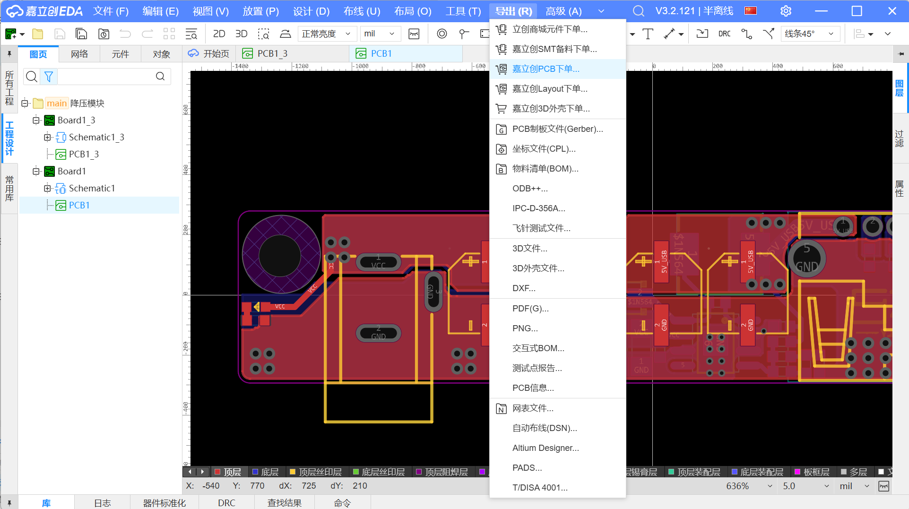

# 项目4 · 嘉立创EDA实践 — 布局与走线

> **目标**：在嘉立创EDA中把原理图变成PCB，重点掌握开关电源的布局铁律。这块板子布局的好坏，直接决定它能不能正常工作。

---

## 第1步：新建工程 + 转PCB

### 操作流程

```
嘉立创EDA专业版 → 新建工程 → 命名为"电源管理模块"
     ↓
在原理图中画出完整电路（参考「项目4-电路搭建详解.md」）
     ↓
设计 → 转换为PCB
     ↓
设置板框：在"板框层"画一个矩形 50mm × 25mm
```

---

## 第2步：元件布局 — 四大铁律实操

### 🥇 铁律一：输入电容紧贴芯片

**摆放顺序**：RT8289GSP → 输入电容C1/C2

```
❌ 错误（电容离得远）：
     C1/C2
       │
       │ ← 5mm以上的走线
       │
  ┌────┴────┐
  │ IN  GND │  ← 寄生电感大 → 电压尖峰
  │ RT8289GSP  │
  └─────────┘

✅ 正确（电容紧贴）：
  ┌────┐
  │C1/C2│ ← 距离≤5mm
  └─┬──┘
    ││
  ┌─┴───────┐
  │IN    GND│ ← 电容正极→IN, 负极→GND
  │ RT8289GSP  │
  └─────────┘
```

### 🥇 铁律二：BOOT电容紧贴BOOT和SW

```
    CBOOT(10nF)
   ┌──────────┐
   │          │
   │  1 BOOT  │ ← 左端接BOOT
   │          │
   │  8 SW   │ ← 右端接SW
   └──────────┘
```

**这个电容非常小（0603）**，可以直接放在RT8289GSP的1脚和8脚之间，走线越短越好。

### 🥇 铁律三：SW节点面积最小化

SW引脚 + 电感L1 + 二极管D1 → 三者摆成**紧凑三角形**：

```
         RT8289GSP
         ┌────┐
         │ SW │ ← ⑥
         └─┬──┘
           │ ← 极短走线
      ┌────┴────┐
      │  L1电感  │
      └────┬────┘
           │
      ┌────┴────┐
    ┌─┤ D1二极管 │
    │ └─────────┘
    │
   GND
```

**注意**：SW节点的铜箔既要**够粗走大电流**，又要**面积尽量小**减少EMI（电磁干扰）——这是一个矛盾，目标是在"够粗"的前提下做到最小。

### 🥇 铁律四：FB走线远离SW和电感区域

反馈电阻R1和R2要放在远离电感和SW的地方：

```
✅ 正确：
                          ┌── FB脚
                          │
      [远离电感的区域]     │
  Vout ───── R1 ──────┬──┤
                       │  │
                       │ R2
                       │  │
                      GND GND
   ↑ FB走线用细线(0.25mm)，不打过孔

❌ 错误：
  Vout ──── R1 ──── FB
                │
              R2 ── GND
                ↑ 走线经过电感或SW下方 → 噪声耦合
```

---

## 第3步：走线

### 走线宽度设置


| 走线段 | 电流 | 线宽 |
|--------|:----:|:----:|
| RT8289GSP的SW → L1 → D1 | ~2A | **1mm（短走线）** |
| L1 → C3/C4 → Vout端子 | ~2A | **1~1.5mm** |
| FB走线 | <1mA | **0.25mm** |
| EN/COMP/SS走线 | 极小 | **0.3mm** |
| 662K的输入输出 | ~100mA | **0.5mm** |
| **GND** | 回路电流 | **大面积铺铜** |

### 走线技巧
走线拐弯要走钝角（直角：过于尖锐的内角可能因腐蚀液流动不畅而残留多余的铜箔。锐角：外角则可能因腐蚀过度而变细，影响电流通过能力。

## 第4步：铺铜（GND平面）

### 为什么需要铺铜？

铺铜 = 用一大片铜皮代替无数条GND走线。好处：

| 好处 | 解释 |
|------|------|
| **低阻抗** | 大面积铜皮电阻几乎为0，GND各点电位一致 |
| **散热** | 铜皮把芯片的热量传导开 |
| **屏蔽** | GND铜皮阻挡电磁干扰 |

### 铺铜操作

```
放置 → 铺铜区域
  ├── 网络：选择 "GND"
  ├── 层：顶层（Top Layer）和底层（Bottom Layer）各铺一次
  ├── 移除孤岛铜：用禁止区域禁止

```

### 铺铜注意事项

```
✅ 正确：一整块连续GND铜皮
  ┌──────────────────────┐
  │ GND  GND  GND  GND   │ ← 所有GND焊盘通过铜皮连在一起
  │  GND  GND  GND  GND  │
  └──────────────────────┘

❌ 错误：GND被走线切断
  ┌──────┬───────────────┐
  │ GND  │ 走线穿过       │ ← GND被切断成两块
  │      │               │
  └──────┴───────────────┘
```

> 铺铜后跑一下DRC——如果有"孤岛铜"（小块悬浮的铜皮），嘉立创EDA会自动报错，选中删除即可。

---

## 第5步：过孔

### 什么时候需要打过孔？

| 场景 | 打几个过孔 | 作用 |
|------|:---------:|------|
| 输入电容C1/C2的GND焊盘 | 各2~3个 | 降低GND回路阻抗 |
| RT8289GSP底部散热焊盘 | 3×3 或 4×4 矩阵 | 散热到背面GND |
| 输出电容C3/C4的GND焊盘 | 各2~3个 | 降低GND回路阻抗 |
| 662K的GND引脚 | 1~2个 | |
| FB走线 | **不打！** | 过孔增加噪声 |

### 过孔参数设置

```
嘉立创EDA默认过孔：
  内径：0.3mm
  外径：0.6mm
  
  不建议改小——立创最小支持0.3mm内径，再小要加钱
```

---

## 第6步：丝印调整

### 丝印标注内容

1.将元器件的丝印放好位置（方面后续焊接找元器件）
2.将实验室的图标放上去，下面再加上自己的名字


## 第7步：DRC检查

### 运行DRC

```
设计 → 设计规则检查（DRC） → 运行
```

### 常见DRC错误及修正

| DRC错误 | 原因 | 修正方法 |
|---------|------|---------|
| 线宽不足 | 某条走线宽度小于规则设置 | 加粗走线 |
| 间距不足 | 两个网络靠太近 | 拉开间距，或加粗隔离区域 |
| 未连接的引脚 | 有引脚没走线 | 检查原理图，确认该引脚是否确实悬空 |
| 孤岛铜 | 铺铜后有小块悬浮铜皮 | 选中删掉，或开启"移除孤岛铜" |
| 丝印重叠 | 位号和文本叠在一起 | 拖动分开 |

### DRC通过标准

```
✅ 所有错误（Error）= 0
✅ 所有警告（Warning）≤ 3（且不影响功能）
✅ 板框闭合
✅ 所有网络有至少一条走线连接（除了故意悬空的）
```

---

## 第8步：导出Gerber + 下单

### 导出Gerber + 嘉立创下单



*↑ 嘉立创下单流程：导出Gerber → 上传 → 确认参数 → 付款*

一般下单在5-7天会发到学校，在这期间，你需要完成（详细可以看 `day6-其他任务.md`）：
1. 去了解如何画元器件、元器件的封装
2. 去了解如何导入元器件

---

## 🧩 拓展延伸 — 小故事

### 🎨 第一款PCB设计软件是怎么来的？

今天你用嘉立创EDA画PCB，鼠标拖一拖、连一连线就完成了。但在1980年代之前，PCB布局是**纯手工**完成的——用胶带在透明薄膜上贴出走线，然后拍照制版。

1986年，一位叫**John Ford**的工程师在加州成立了一家小公司 **Accel Technologies**，开发了第一款在个人电脑上运行的PCB设计软件——**Tango PCB**。它只能在DOS系统上运行，用键盘输入坐标而不是鼠标拖拽，一张A4大小的原理图需要一整天才能画完。

1990年代，随着Windows的普及，PCB软件进化到了鼠标拖拽的图形界面——Protel（后来的Altium Designer）、PADS、EAGLE相继出现。

2010年代，**嘉立创EDA**（当时叫立创EDA）由中国团队推出，它有一个革命性的特点：**免费、在线、无需安装**。以前画PCB需要装几个G的软件、配破解、配库文件，现在打开浏览器就能用。

> 从手贴胶带到DOS键盘输入，再到浏览器在线画板——PCB设计工具的进化，让一个高中毕业生今天就能做到1980年代一个专业团队才能做的事。

### 📏 为什么PCB走线要45度角而不是直角？

你在嘉立创EDA中走线时，默认的转角是45度。为什么不是90度直角？

```
90度直角走线：
   ────┐
       │  ← 信号走到这里会"撞墙"→ 反射 → EMI
       └────

45度角走线：
   ────╱
       ╲  ← 信号平滑通过 → 反射小 → EMI低
       ────
```

1990年代，高频电路开始普及，工程师发现**90度直角走线**在高频下会产生两个问题：
1. **阻抗突变**——走线宽度在转角处变宽（对角线比直线宽1.4倍），信号发生反射
2. **EMI辐射增强**——直角处电场集中，产生电磁辐射

从那以后，45度角走线就成了PCB设计的行业标准。现在的EDA工具（包括嘉立创EDA）默认就是45度角——你不用刻意去切，软件已经帮你做了最优选择。

> **一句话**：45度角 ≈ 信号走得更顺，EMI更少。这是30年前高频工程师踩坑踩出来的经验。
