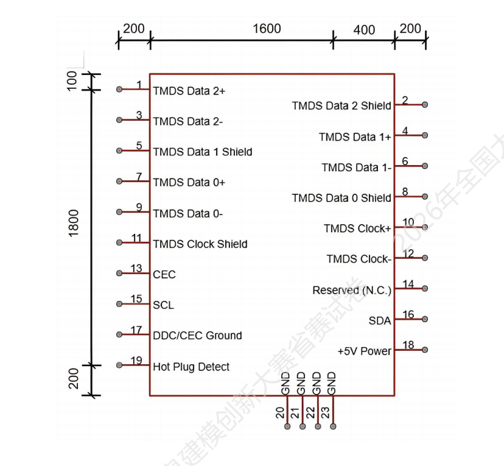
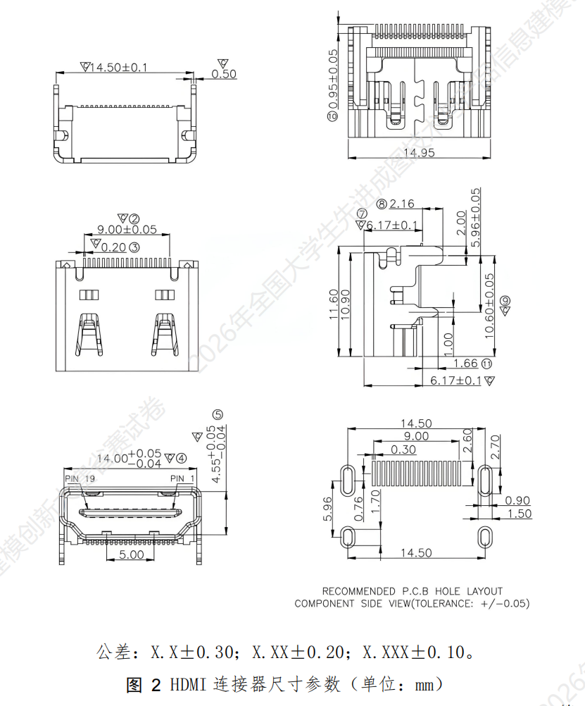
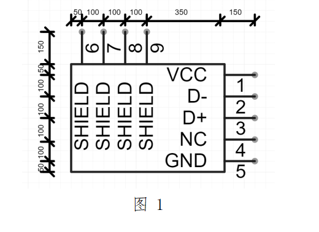
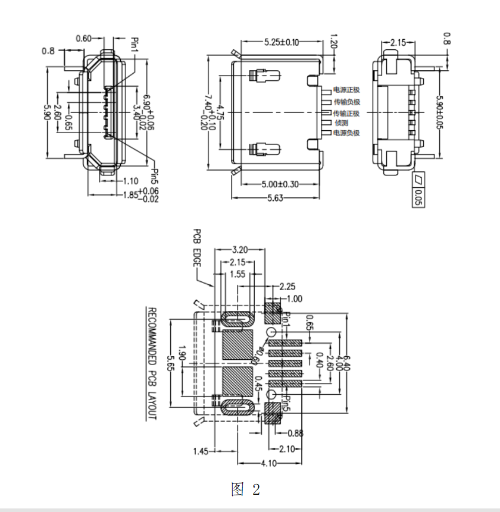
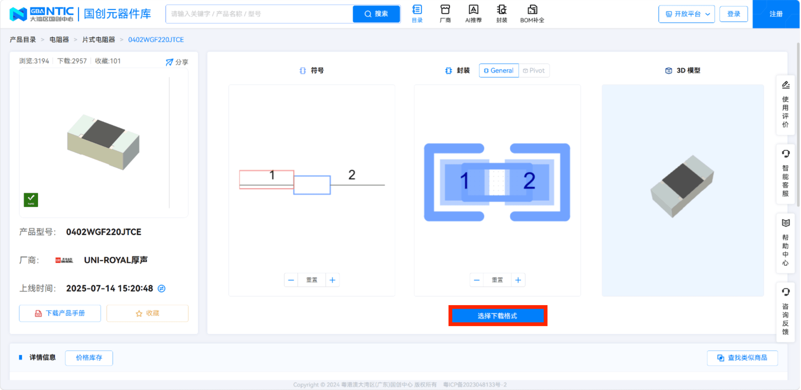
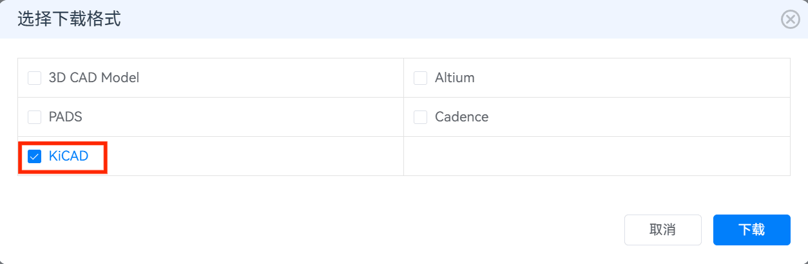
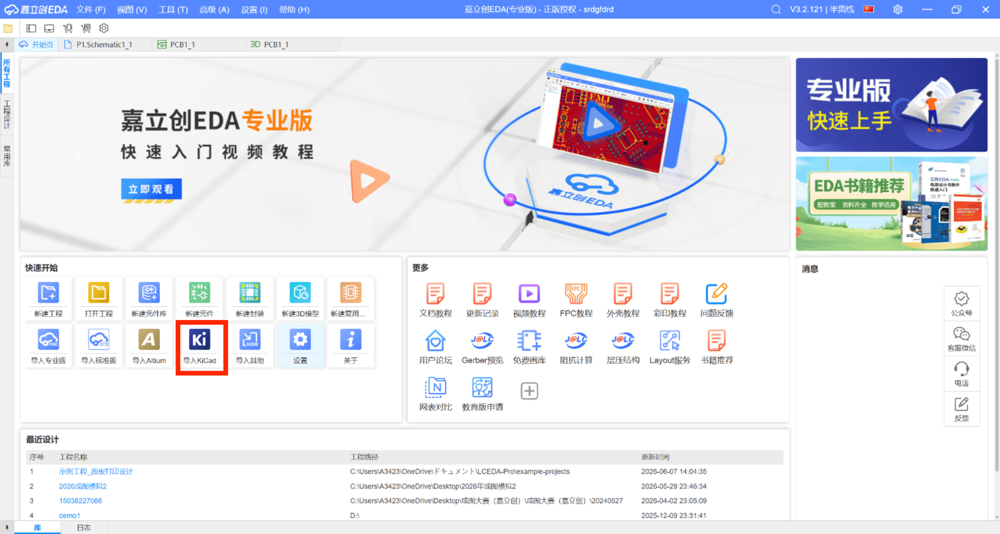
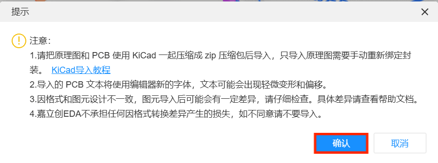
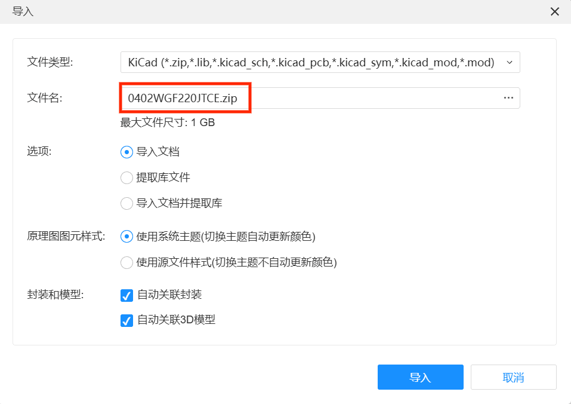
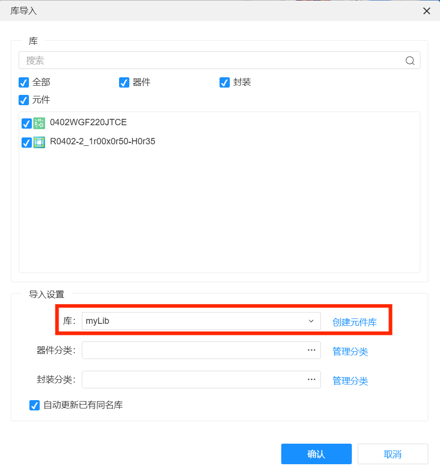

# Day 6 — 其他任务 · 等板期间的自学内容

板子已经下单了，在等板的5-7天里，除了复习前面的内容，下面两个是值得花时间自学的技能。

---

## 任务一：学习画元器件封装

在嘉立创EDA中，元器件分为两部分：**原理图符号**（在原理图中显示的图形）和**PCB封装**（在PCB中显示的焊盘图形）。

### 什么时候需要自己画？

嘉立创EDA的元件库已经包含了上百万种常见元件（662K、RT8289GSP、SS54等都有），大多数情况直接搜索即可。但以下情况需要自己画：

- 你手里有一个**非标准元件**（库里面搜不到）
- 你想用某个**特殊封装**（比如把插件电容改成贴片）
- 你想**定制**焊盘尺寸（比如加大的焊盘便于手工焊接）

### 学习路径

| 步骤 | 内容 | 在嘉立创EDA中的位置 |
|:----|:-----|:-------------------|
| ① | 新建元件库，命名为my_lib | 上方 → 文件 → 新建 → 元件库 |
| ② | 新建元件 | 在下方 → 库 → my_lib → 新增 → 元件 |
| ③ | 新建封装 | 在下方 → 库 →my_lib → 封装 → 新增 |

焊盘尺寸请参考元件的**数据手册**中的"Package Dimensions"页，照着上面的数值画即可。

#### 元件图一：新建元件库与新建元件

 

*↑ 左：新建元件库（命名为my_lib）；右：在元件库中新建元件，设置名称和前缀*

#### 元件图二：新建封装

 

*↑ 左：在元件库中新建封装；右：放置焊盘、画丝印外框*

### 画封装的小技巧

| 技巧 | 说明 |
|:----|:------|
| **焊盘编号要和原理图符号一致** | 比如原理图中引脚①对应封装焊盘①，不能搞混 |
| **丝印外框比元件实际尺寸大0.2mm** | 留出安装余量，方便焊接 |
| **极性标记要明显** | 二极管、电解电容等有极性的元件，在丝印层画上标记 |
| **焊盘中心间距要精确** | 用数据手册上的尺寸，用尺子量实物反推不靠谱 |

## 任务二：学习导入元器件

国创电子元器件导入嘉立创 EDA 的方法指引（https://www.bocangku.com/?from=888&activityId=100002022）
### 导入流程

1.登录国创电子元器件库，查找到需要的元器件并点击【选择下载格式】；
① 在自己建的元件库里画好封装


2.选择【KiCAD】下载并解压文件；
② 在原理图中选中元件 → 右侧"属性"面板 → "封装"


3.在嘉立创 EDA 的开始页中点击【导入 KiCad】；
③ 点"选择" → 在弹出窗口中选你自己刚画的封装

 
4.选择需要导入的 Kicad 符号文件，并确认库中的放置路径；
④ 保存 → 更新PCB → 元件自动变成你的新封装

 


### 遇到"封装找不到"怎么办？

嘉立创EDA最有用的功能之一：**搜索立创商城的物料编号（LCSC Part#）**。

```
比如：搜索 "C82942"（662K在立创商城的编号）
→ 自动带出封装和3D模型 → 直接使用

如果你买元件时记下了立创商城的物料编号：
1. 在原理图元件属性的"LCSC编号"栏输入
2. 嘉立创EDA自动匹配封装
3. 连画都不用画
```

---

> **一句话总结**：封装不是每次都要自己画——先用现成的，搜不到再画。立创商城的编号是最高效的捷径。

---

## 🧩 拓展延伸 — 小故事

### 🧩 第一个集成电路——从"三极管"到"芯片"

1947年，贝尔实验室的**肖克利、巴丁、布拉顿**发明了点接触式三极管，获得了诺贝尔奖。但这时的三极管是"分离元件"——每个三极管是独立的一小颗，需要用导线连起来。

1958年，德州仪器的年轻工程师**杰克·基尔比**（Jack Kilby）发现了一个问题：**随着电路越来越复杂，分离元件之间的导线越来越多，电路的可靠性越来越低、体积越来越大。** 他想到一个天才的解决方案：**为什么不用一块半导体材料，把电阻、电容、三极管都做在上面呢？**

他在一块锗片上制作了第一个**集成电路**——只有一个三极管、几个电阻和一个电容，用细细的金线连接。这就是世界上第一块"芯片"。

今天你焊在板子上的662K和RT8289GSP，里面集成了**几万个到几百万个**三极管和MOS管——全都做在同一块小小的硅片上。

> 从分离三个脚的三极管，到集成几百万个管的芯片——集成电路的发明，让今天一块小板子上的电路，超过1960年代整栋楼里的电子设备。**没有集成电路，就没有你手里这块电源管理模块。**

### 🔍 "封装"这个名字的由来

为什么叫"封装"（Package）？因为芯片本身是一片比指甲还薄、比米粒还小的硅片（Die），它太脆弱了，不能直接焊在PCB上——必须给它**封装**起来，加上引脚，才能用。

```
裸片（Die）：          封装后的芯片：
┌──────┐              ┌──────────────┐
│ 硅片  │   → 封装 →   │ ①   662K    │
│~2×2mm │              │    SOT-23-3 │
└──────┘              └──────────────┘
```

最早的芯片封装是**TO（Transistor Outline）**——直接把三极管的金属外壳借过来用。后来的**DIP（双列直插）**封装统治了1970~90年代。现在主流的是**SOP（小外形封装）**和**QFP（四边扁平封装）**。

> 封装技术的发展史，就是电子设备越做越小的历史。你焊的SOT-23-3（662K）比1980年代的TO-220小了20倍——但也更难焊了。**每种封装都是在"散热、易焊、体积"之间的权衡。**
