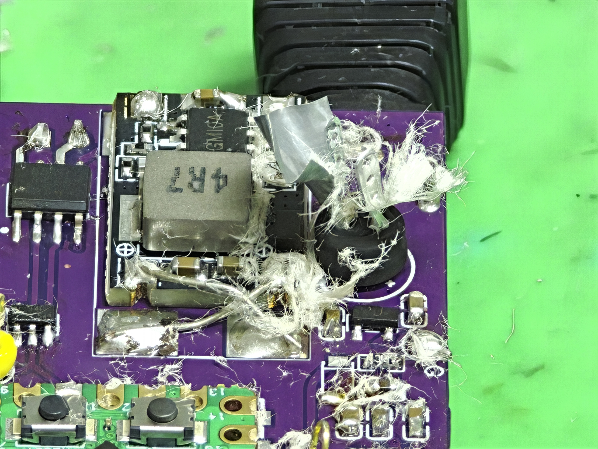

# 项目1 · NE555流水灯电路

> **封装类型**：🔌 全插件（直插/Through-Hole）  
> **难度**：★☆☆☆☆  
> **画板时间**：1周（约5天，每天2-3小时）  
> **核心教学目标**：走完"原理图→PCB→下单→焊接→点亮"的完整闭环，同时建立对常见基础元件的系统认知

---

## 1. 项目简介

这是你第一个PCB项目。我们要设计一块板子，上电后10个LED灯依次循环点亮，像水一样流动——这就是"流水灯"。

<流水灯GIF>

电路的核心是两个经典芯片：

| 芯片 | 功能 |
|------|---------------|
| NE555 | 产生方波时钟信号——像心脏一样为整个电路提供规律的节拍 |
| CD4017 | 十进制计数器——每收到一个节拍，就把10个输出脚依次拉高 |

它们都是DIP封装（两排引脚插进焊盘孔里），焊接友好，非常适合入门。

#### NE555 —— 本项目的「心脏」

NE555 是一个经典的**定时器 IC**。在本项目中，它被接成**多谐振荡器**（Astable Multivibrator）模式，功能很简单：**持续输出 0V / 5V 交替的方波**，作为整个流水灯的时钟信号。

```
NE555                CD4017                LED×10
  ┃                    ┃                     ┃
  ┃  方波（CLK）  →    ┃   按节拍依次拉高  →  ┃   逐个点亮
  ┃  约 0.5~2 Hz       ┃    Q0→Q1→…→Q9      ┃
  ┃                    ┃                     ┃
  节拍源头              移位执行              输出
```

> **一句话：NE555 定节奏，CD4017 走位置。没有 NE555 的方波输出，CD4017 不计数、LED 全灭。**

**在本章你只需要建立三个认知：**

| # | 认知 | 答案（详细推导在 §3.2） |
|---|------|------------------------|
| ① | NE555 产出什么？ | 0V ↔ 5V 交替的**方波**，频率约 0.5~2 Hz（肉眼可分辨） |
| ② | 频率由什么决定？ | 仅由 3 个外围元件决定：R1、R2、C1。改 R2 或 C1 就能调速 |
| ③ | 输出接到哪里？ | CD4017 的 **CLK 脚**（14脚），每个上升沿 CD4017 往前推一个 LED |

> 💡 **初学提示**：NE555 内部原理（比较器 + RS触发器 + 放电管）放在 **§10 拓展思考**。本章先把它当黑盒子——知道"输入 5V、配 3 个外围元件、输出方波"就够用了。

### 1.1 你将学到什么

- 认识电阻、电容、LED、二极管、IC等基础元件的实物、符号和关键参数
- 在立创EDA中绘制完整的原理图
- 把原理图转成PCB并手动布局布线
- 运行DRC检查并导出生产文件
- 在嘉立创下单打样（免费打样）
- 拿到板子后亲手焊接，上电看到LED跑起来

### 1.2 关键术语速查表

> 以下术语贯穿整个PCB设计过程。现在先通读一遍有个印象，后面每用到一个就回来对照——不用死记。

| 术语 | 一句话解释 | 在哪一步用到 |
|------|-----------|:----------:|
| **原理图（Schematic）** | 电路的逻辑连接图——表示"谁和谁连在一起"，不关心物理位置 | 画原理图时 |
| **网表（Netlist）** | 原理图到PCB的"桥梁"——描述所有元件和连接关系的列表 | 原理图转PCB时 |
| **网络（Net）** | 原理图中电气连通的一组节点。VCC、GND、每根导线都是一个网络 | 画原理图时 |
| **封装（Footprint）** | 元件在PCB上的物理"脚印"——焊盘位置、引脚间距、外形尺寸 | 原理图中给元件绑定封装时 |
| **焊盘（Pad）** | PCB上焊接元件的金属接触点。插件焊盘=孔+环，贴片焊盘=表面铜块 | PCB布局时 |
| **丝印（Overlay）** | PCB表面的白色字符层——标位号(R1/C1)、极性、版本号。无电气功能 | PCB收尾时 |
| **阻焊（Solder Mask）** | PCB表面的绿色油墨——覆盖不需要焊接的铜箔，焊盘处"开窗"露铜 | 工厂制板 |
| **过孔（Via）** | 从顶层钻到底层的导电孔，孔壁镀铜，用来连接不同层的走线 | PCB布线时 |
| **铺铜（Copper Pour）** | 在PCB上大面积覆盖铜皮（通常接GND）——减少地线阻抗、散热 | PCB收尾时 |
| **飞线/鼠线（Ratsnest）** | 原理图转PCB后元件之间的细线——提示"这两个焊盘需要连通"，不是实际走线 | PCB布局时参考 |
| **DRC** | 设计规则检查——自动检查走线宽度/间距/过孔是否违反制造约束 | PCB完成后、导出前 |
| **ERC** | 电气规则检查——自动检查原理图有没有悬空引脚、短路等逻辑错误 | 原理图完成后 |
| **Gerber** | PCB工厂生产用的标准文件格式——每个层一个文件 | 导出下单时 |

> 💡 **三个最容易被新手混淆的概念**：  
> - **丝印 ≠ 铜** — 丝印是印上去的白色字，不导电；走线是铜，导电  
> - **飞线 ≠ 走线** — 飞线是提示"该连"，走线是你画上去的铜；布线完成=所有飞线消失  
> - **阻焊 ≠ 铜** — 阻焊是盖在铜上面的绿色油墨；焊盘处阻焊"开窗"露出铜才能焊

---

## 2. 认识基础元件

> 这一节是项目1最重要的部分。花足够时间把每种元件认清楚、参数搞明白，后续所有项目都会反复用到。

### 2.1 电阻（Resistor）

**实物长什么样？**

插件电阻是一个圆柱体，两头有金属引脚，身上有4条（或5条）彩色环。

```
   ┌─────────────┐
───┤ 棕 黑 红 金 ├───
   └─────────────┘
      ↑ 色环 ↑
```

> 🔗 插件电阻身上的色环可以直接读出阻值，完整读法和颜色对照表见文末 **[附录：插件电阻色环读法](#附录插件电阻色环读法)**——给好奇宝宝看的。日常焊接我们还是推荐用万用表：

> ⚠️ 科技在进步，时代在发展——色环这玩意儿记了也用不上，考试也不考。真需要用的时候拿手机查一下就行，日常焊接直接用万用表。

**什么时候需要用色环？** 实在无计可施的时候——比如整包标签丢了、散落一地分不清了，才用色环分辨。

**电阻的三个关键参数**

| 参数 | 含义 | 本项目选型 |
|------|------|-----------|
| **阻值** | 电阻的大小，单位Ω（欧姆） | LED限流：**1kΩ**；NE555定时：1kΩ~100kΩ |
| **功率** | 能承受多大的电流发热而不烧毁 | 全部用 **1/4W（0.25W）**，最通用的插件电阻 |
| **精度** | 实际阻值与标称值的偏差 | 普通用±5%（金环），要求高的用±1%（棕环） |

#### ⚡ 电阻的功率是怎么来的？—— 从能量守恒说起

电流通过电阻时，电子与导体原子不断碰撞，把电能转化为热能——这就是**电阻发热**的根本原因。能量不会凭空消失，电能进去了，就以热量的形式跑出来了。

**电功率的定义**（适用于任何元件）：

$$P = V \times I$$

> P：功率（W，瓦特）&nbsp;&nbsp;|&nbsp;&nbsp;V：元件两端的电压（V）&nbsp;&nbsp;|&nbsp;&nbsp;I：流过元件的电流（A）

对于电阻，欧姆定律把 V 和 I 绑定了：V = I × R。代入上式得到电阻专用形式：

$$P = I^2 R \quad\text{或}\quad P = \frac{V^2}{R}$$

三个公式等价，用哪个取决于你已知什么：
- 知道电流和阻值 → **P = I²R**（最常用）
- 知道电压和阻值 → **P = V²/R**（电阻直接跨接在电源两端时用）
- 知道电压和电流 → **P = VI**

> 📝 **本项目例子**：LED限流电阻 **1kΩ**，红色LED压降约 1.8V，电阻两端电压 = 5V - 1.8V = **3.2V**。
>
> 由欧姆定律算出实际电流：I = V/R = 3.2V ÷ 1000Ω = **0.0032A = 3.2mA**（LED在3mA下已经够亮了）。
>
> 用三种公式验算电阻功耗，结果完全一致：
> - P = I²R = (0.0032)² × 1000 = **0.010W**
> - P = V²/R = 3.2² ÷ 1000 = **0.010W**
> - P = V×I = 3.2 × 0.0032 = **0.010W** ✅
>
> 0.01W 远小于 0.25W，放心用。

**这些热量去哪了？** 电阻把电能转化成热能 → 电阻自身温度升高 → 热量通过引脚传导和空气对流散到周围环境。如果产热速度 > 散热速度，电阻温度会不断升高，最终烧毁。

这就是为什么电阻有**额定功率**——它表示"在 25°C 环境下，这个电阻能持续安全耗散的最大功率"。超过这个值，电阻会过热、阻值漂移、冒烟、甚至烧断。

> **常见功率等级（插件）**：1/8W（小个子）、1/4W（最常见）、1/2W（略粗）、1W（明显大一圈）、2W（水泥电阻级别）。功率越大，体积越大——**大体积 = 大表面积 = 更好的散热能力**。

#### ⚡ 功率裕量（降额）—— 永远别让电阻"满负荷"跑

电阻的标称功率是在 **25°C 理想散热条件** 下测的。现实中没有理想条件——电阻装在壳子里、旁边有其他发热元件、夏天环境温度高……这些都会让电阻的实际散热能力打折扣。**所以必须留余量**。

**降额规则**：实际功耗应 ≤ 额定功率 × 降额系数。

| 降额系数 | 适用场景 | 解释 |
|:---:|------|------|
| **70%** | 🏠 一般情况，推荐 | 电阻实际功耗不超过标称功率的70%，留30%安全余量 |
| **80%** | ⚡ 极限一些，可以接受 | 空间紧张、成本敏感时可用，但不建议长期这样跑 |
| **50%~60%** | 🛡️ 手头宽裕 / 高可靠场合 | 工业、汽车、航空等场合常用50%降额；自己玩有余量就多留 |

> **为什么不能用到100%？** 标称功率是在25°C下测的，但电阻工作时自身会发热。当环境温度升到70°C以上时，电阻的实际功率承受能力会大幅下降（查数据手册的"功率降额曲线"）。70%降额 ≈ 给自己买了个"温度保险"。

**贴片电阻的功率**（对比插件）：

| 封装 | 典型功率 | 70%降额可用 |
|------|:---:|:---:|
| 0603 | 1/10W (0.1W) | ≤ 0.07W |
| 0805 | 1/8W (0.125W) | ≤ 0.088W |
| 1206 | 1/4W (0.25W) | ≤ 0.175W |
| 2512 | 1W | ≤ 0.7W |

#### 📝 示例：给一个电阻选功率等级

> **场景**：某电机驱动电路中有一个 **10Ω 电流采样电阻**，流过的电流实测为 **0.5A**。
> 问：该选多大功率的电阻？

**第一步：算实际功耗**

$$P = I^2 R = (0.5\text{A})^2 \times 10\Omega = 0.25 \times 10 = 2.5\text{W}$$

**第二步：用降额规则反推额定功率**

| 降额标准 | 计算 | 需求额定功率 | 实际可选 |
|:---:|------|:---:|:---:|
| 80%（极限） | 2.5W ÷ 0.8 = 3.125W | ≥ 3.125W | **5W** |
| 70%（推荐） | 2.5W ÷ 0.7 ≈ 3.57W | ≥ 3.57W | **5W** |
| 60%（宽裕） | 2.5W ÷ 0.6 ≈ 4.17W | ≥ 4.17W | **5W** |
| 50%（保守） | 2.5W ÷ 0.5 = 5W | ≥ 5W | **5W** |

> 标准功率等级：1/8W → 1/4W → 1/2W → 1W → 2W → **3W** → **5W** → 7W → 10W

**第三步：结论**

选 **5W** 电阻。无论按哪个降额标准，5W都满足。

❌ 为什么不能选 **3W**？ 2.5W ÷ 3W = **83.3%**——超过了80%这条线，长期工作有烧毁风险（尤其夏天或散热不良时）。

❌ 为什么不能选 **2W**？ 2.5W > 2W，直接超额定功率，很快烧掉。

✅ **5W 电阻**：2.5W ÷ 5W = 50%，在50%~80%区间内，所有降额档次都满足。

> 💡 **一句话**：算出实际功耗后，除以0.7（或0.8），然后往上取最近的标准功率等级。

#### 🤔 思考题：手上没有合适功率的电阻怎么办？

> **场景**：5V 供电，负载 4Ω，需要串联一个限流电阻把电流限制在 0.25A。
>
> 自己算一下：
> - 限流电阻应该多大？__________
> - 这个电阻承受多大功率？__________
> - 该选多大功率的电阻？__________
>
> 现在翻遍元件盒，**只有 1/4W 的 1kΩ 电阻**。单颗 1kΩ 阻值不对，1/4W 功率也不够。
>
> **怎么用这些 1kΩ 1/4W 电阻，通过串并联组合，同时满足 阻值 ≈ 计算值 且 每颗都不超功率裕量？**
>
> 🔗 答案见文末 **[附录：思考题答案](#附录思考题答案--电阻串并联解决功率不足)**。先自己试试，再看答案。

**常用阻值速查表（E24系列，挑这些就够）**

```
10  12  15  18  22  27  33  39  47  56  68  82
100 120 150 180 220 270 330 390 470 560 680 820
1k  1.2k 1.5k 1.8k 2.2k 2.7k 3.3k 3.9k 4.7k 5.6k 6.8k 8.2k
10k 12k 15k 18k 22k 27k 33k 39k 47k 56k 68k 82k
100k 120k 150k 180k 220k 270k 330k 390k 470k 560k 680k 820k
1M
```

**在立创EDA原理图中**：电阻的符号是一个锯齿线（国际标准）或长方形（美国标准），旁边标注 "R?" 和阻值如 "1k"。

### 2.2 电容（Capacitor）

**实物长什么样？**

插件电容分两大类：

| 类型 | 外观 | 特点 |
|------|------|------|
| **瓷片电容**（陶瓷电容） | 扁圆形小圆片，土黄色或蓝色 | 无极性，容量小（pF~0.1μF），高频特性好 |
| **电解电容** | 圆柱体带塑料外皮，顶部有十字刻痕 | **有极性**（分正负极！），容量大（1μF~几千μF），用于电源滤波 |

- 瓷片电容两脚一样长，不分正负。
- 电解电容长脚=正极，外壳上负极一侧有白色条纹上印着 "-"。

**电容的三个关键参数**

| 参数 | 含义 | 本项目选型 |
|------|------|-----------|
| **容量** | 储存电荷的能力，单位F（法拉），常用μF（微法）、nF（纳法）、pF（皮法） | 0.01μF（瓷片）、10μF/100μF（电解） |
| **耐压** | 电容能承受的最高电压，超过会击穿甚至爆炸 | 瓷片：50V够用；电解：**16V或25V**——留余量！本项目5V供电，10V耐压即可 |
| **类型** | 瓷片/电解/钽/独石/CBB等 | 我们只用瓷片和电解 |

**容量标识方法**

- 瓷片电容：通常印三位数字，如 "104" = 10 × 10⁴ pF = 100,000 pF = **0.1μF**
  - "103" = 0.01μF，"102" = 1nF，"471" = 470pF
- 电解电容：直接印在侧面，如 "100μF 25V"

#### ⚡ 耐压裕量（降额）—— 电容比电阻更需要留余量

和电阻的功率降额同理，电容的耐压也必须留余量。而且电容的后果比电阻严重得多：

| 元件 | 超限后果 |
|------|------|
| 电阻过功率 | 发热 → 烧断 → 开路（通常不危险） |
| 电容过压 | 击穿 → **短路**（瓷片/MLCC）或 **爆炸/起火**（电解/钽）|

**所以电容的降额要比电阻更保守。**

**降额规则**（实际电压 ≤ 额定耐压 × 降额系数）：

| 电容类型 | 推荐降额 | 极限 | 说明 |
|------|:---:|:---:|------|
| **瓷片 / MLCC** | 70% | 80% | 陶瓷电容过压后会短路，但在低压电路中后果相对可控 |
| **电解电容** | 60%~70% | 80% | 电解老化后耐压会下降，且过压失效可能炸开；多留点余量 |
| **钽电容** | **≤50%** | — | ⚠️ 钽电容过压失效模式是**短路+起火**，非常危险，**必须严格降额到50%以下** |

> 💡 这就是为什么"1.5~2倍"（相当于50%~67%降额）是个好习惯：5V供电选16V耐压 → 5÷16≈31%，相当于69%降额，安全。

> 💥 **一个小故事**
>
> 曾经有人（别问是谁）在 24V 电源板上手滑装了一颗耐压 **10V** 的电解电容。上电几秒后——**"嘭！"**——声音堪比火柴炮。电容的铝壳像子弹一样飞出去，里面卷绕的铝箔和电解液纸屑炸得满桌子都是。
>
> 那颗电容的规格是 **10V / 380μF**。24V 加在 10V 耐压上——超了 2.4 倍，电解液瞬间沸腾气化，内部压力直接把铝壳顶飞。
>
>  
>
> 至于是谁……哎，问就是别问。
>
> **教训**：电解电容的耐压不是"建议值"——是生存底线。超了就炸，没有商量的余地。

**常见耐压等级**：6.3V → 10V → 16V → 25V → 35V → 50V → 63V → 100V

> 📝 **选型示例**：12V供电电路，选多大耐压的电解电容？
> - 70%降额：12V ÷ 0.7 ≈ 17.1V → 选 **25V**
> - 80%降额（极限）：12V ÷ 0.8 = 15V → 选 **16V**（刚好够，但无余量应对电压波动）
> - 推荐：选 **25V**，12÷25=48%，在60%~70%区间，安全。
>
> ❌ 不能选10V——10V < 12V，直接超耐压，必炸。

> ⚠️ **电解电容极性绝对不能反**——反接会发热、鼓包、甚至炸开（顶部十字刻痕就是泄压用的）。

**在立创EDA原理图中**：无极性电容是两条平行线，有极性电解电容一侧是直线（正极）一侧是弧线。

### 2.3 LED（发光二极管）

**实物长什么样？**

插件LED是一个透明（或彩色）的小半球，底部两个引脚：**长脚=正极（Anode），短脚=负极（Cathode）**。从侧面看，LED内部大金属片的一端是负极，小金属片是正极。

**LED的关键参数**

| 参数 | 含义 | 本项目值 |
|------|------|---------|
| **颜色** | 发什么光 | 红色（最便宜、压降最低） |
| **正向压降（Vf）** | LED导通时两端的电压，不同颜色不同 | 红≈1.8~2.0V，绿≈2.2~2.4V，蓝/白≈3.0~3.2V |
| **工作电流（If）** | 建议通过的电流 | 普通LED：20mA(Max)，**1~5mA 亮度就够** |

**限流电阻怎么算？**

LED不能直接接电源——它是二极管，电压超过Vf后电流会急剧增大烧掉。必须串联一个限流电阻：

$$R = \frac{V_{CC} - V_f}{I_f}$$

> 例：5V供电，红色LED（Vf=1.8V），用 1kΩ 限流电阻  
> I = (5 - 1.8) / 1000 = **0.0032A = 3.2mA**——亮度足够，省电又不刺眼  
>
> 在 5V 以内的数字电路中，**1kΩ 是 LED 限流电阻的通用取值**——不用每次算，拿一颗 1kΩ 焊上去就行。  
> 电压稍高（>10V）时，一般用 10kΩ。
> 主要是因为1kΩ、4.7k、10kΩ电阻的使用频率相对较高，焊接取料的时候拿取方便

**在立创EDA原理图中**：LED符号是一个三角形箭头加一条横线，带两个向外箭头表示发光。

### 2.4 二极管（Diode）

**实物长什么样？**

插件二极管最常见的是：
- **1N4148**：小信号开关二极管，红色玻璃封装，很小
- **1N4007**：整流二极管，黑色塑料封装较粗，耐压1000V、电流1A

二极管有极性：圆柱体一端有一圈**色环（通常黑色或白色），色环端 = 负极（Cathode）**。

**二极管的关键参数**

| 参数 | 含义 |
|------|------|
| **正向压降** | 导通时电压降（硅管≈0.7V，肖特基≈0.3V） |
| **反向耐压** | 反向不导通时能承受的最大电压 |
| **最大正向电流** | 能持续通过的最大电流 |

**在立创EDA原理图中**：符号和LED一样是三角形箭头+横线，但没有发光箭头。

### 2.5 IC 芯片与IC座

**实物长什么样？**

NE555和CD4017都是**DIP（Dual Inline Package，双列直插）**封装——黑色塑料方块，两侧各一排引脚。

| 芯片 | 封装 | 引脚数 |
|------|------|--------|
| NE555 | DIP-8 | 8脚 |
| CD4017 | DIP-16 | 16脚 |

**引脚编号规则**：芯片正面（有字那面）朝上，缺口朝左，**左下角为1脚，逆时针数**。有些芯片在1脚旁有个小圆点标记。

**IC座（芯片座）**：强烈建议焊接时**先焊IC座，再把芯片插进IC座**——理由是：
- 直接焊芯片，烙铁高温可能烫坏芯片
- 芯片坏了要拆焊很麻烦，有IC座直接拔下来换
- 调试时可以把芯片拔下来单独测试

IC座也分DIP-8和DIP-16，买和芯片匹配的。

**本项目不深入NE555和CD4017的内部结构**——先把它们当成"黑盒子"用，知道每个脚的功能就行。内部原理放在最后的"拓展思考"部分。

### 2.6 其他插件元件

| 元件 | 实物 | 用途 |
|------|------|------|
| **排针** | 一排列成一排的方头金属针，间距2.54mm | 引出电源、信号，方便接杜邦线 |
| **排母** | 排针的"插座" | 对接排针，做可插拔的连接 |
| **轻触按键** | 方形小按键，四个脚（内部两两连通） | 复位、模式切换等 |
| **拨动开关** | 带拨杆的开关，常见的3脚（中间公共、两边选通） | 电源开关 |
| **DC电源插座** | 圆孔插座，外径5.5mm内径2.1mm | 外接直流电源适配器 |

**在立创EDA原理图中**：排针用 "排针 1×N" 或单个排针符号拼接；按键用常开触点的按键符号。

---

## 2.7 如何阅读芯片数据手册（Datasheet）

> 学到这里，你第一次面对"芯片"这个黑盒子。NE555和CD4017怎么用？哪个脚接电源？典型电路长什么样？——这些问题的答案都在**数据手册（Datasheet）**里。

数据手册是芯片厂商写的"使用说明书"。第一次看会觉得厚（几十到几百页），但**不需要全读**。只需要定位以下几个关键章节：

| # | 章节 | 找什么 | 重要性 |
|---|------|--------|:------:|
| ① | **Pin Description（引脚定义）** | 每个引脚的名字、功能、类型（输入/输出/电源）。**拿到芯片第一个看——知道哪个脚接电源、哪个接地、哪个是信号** | ⭐⭐⭐ |
| ② | **Typical Application（典型应用电路）** | 芯片厂商给出的参考电路图。**直接照着画比你自己琢磨靠谱100倍** | ⭐⭐⭐ |
| ③ | **Absolute Maximum Ratings（绝对最大值）** | 电压/电流/温度的极限——**超过任何一个数字，芯片永久损坏**。实际使用不超过80% | ⭐⭐⭐ |
| ④ | **Recommended Operating Conditions（推荐工作条件）** | 芯片正常工作需要的电压、温度、频率范围——**你的设计依据** | ⭐⭐⭐ |
| ⑤ | **Electrical Characteristics（电气特性）** | 输出高/低电平、驱动能力、功耗等——判断能不能驱动下一级电路 | ⭐⭐ |
| ⑥ | **Package Information（封装尺寸）** | 芯片的物理尺寸图：引脚间距、本体长宽。**自己画封装时必须对照此图核对每一个尺寸** | ⭐⭐（初学者不用自己画） |
| ⑦ | **Functional Description（功能说明）** | 芯片内部怎么工作的——本项目放到"拓展思考"部分，初学不用读 | ⭐（进阶再读） |

**实战：请现在下载NE555和CD4017的数据手册，做以下练习：**

1. 打开 NE555 的数据手册，找到 **Pin Description**——对照本项目 3.2 节的引脚功能表，看能不能一一对上
2. 找到 **Typical Application** 中的"Astable Multivibrator"（多谐振荡器）电路图——这就是我们用的电路
3. 打开 CD4017 的数据手册，找到它的引脚定义和时序图——看Q0~Q9依次变高的波形图

> 💡 **习惯养成**：以后每接触一个你没用过的芯片，第一件事就是下载它的数据手册，定位上面7个章节。10分钟就能搞清楚这芯片怎么用——这比百度搜"XXX芯片怎么接线"高效且准确。

---

## 3. 电路原理（功能级说明）

> 本节只讲每个部分**做什么**和**外围元件怎么选**。NE555和CD4017的内部原理放到最后的"拓展思考"。

### 3.1 总体框图

```
电源(5V)
  │
  ├──→ NE555时钟电路 ──→ CD4017计数器 ──→ 10路LED
  │       ↓                    ↓
  │   产生方波脉冲         依次点亮Q0~Q9
```

整个电路分三块：

### 3.2 第一块：NE555 时钟发生器

NE555在这里被接成"多谐振荡器"模式——说白了就是**自动产生连续的方波**，不需要外部触发。

外围只有3个元件：R1、R2、C1。

- **R1**（接在VCC和DIS脚之间）：决定电容充电速度
- **R2**（接在DIS脚和THR/TRIG脚之间）：决定电容放电速度
- **C1**（接在THR/TRIG脚和GND之间）：定时电容，充放电的"水池"

**输出频率公式**（直接用，先不推导）：

$$f = \frac{1.44}{(R_1 + 2R_2) \cdot C_1}$$

> 比如：R1=10kΩ，R2=100kΩ，C1=10μF  
> f = 1.44 / ((10000 + 2×100000) × 0.00001) = 1.44 / (210000 × 0.00001) ≈ **0.69Hz**  
> 也就是说LED大约每1.5秒切换一次——肉眼能清晰看到流动效果。

**调整流水速度**：改R2或C1。R2越大/C1越大 → 频率越低 → 流水越慢。

**NE555引脚功能速查**（只需要知道各脚接什么，不讲为什么）：

| 引脚 | 名称 | 本项目接法 |
|------|------|-----------|
| 1 | GND | 接地 |
| 2 | TRIG（触发） | 接R2和C1的结点 |
| 3 | OUT（输出） | **去CD4017的CLK脚**——这就是时钟信号 |
| 4 | RESET（复位） | 接VCC（不让他复位） |
| 5 | CTRL（控制电压） | 对地接一个0.01μF小电容（防干扰，标准做法） |
| 6 | THR（阈值） | 和2脚短接，一起接R2和C1的结点 |
| 7 | DIS（放电） | 接R1和R2的结点 |
| 8 | VCC | 接5V电源 |

### 3.3 第二块：CD4017 十进制计数器

CD4017是一个"约翰逊计数器"——每收到一个时钟脉冲（上升沿），它的10个输出脚（Q0~Q9）就**依次**变成高电平，任何时候有且仅有一个输出为高。

- **CLK脚**（14脚）：接NE555的输出——每来一个方波的上升沿，输出向后移一位
- **Q0~Q9**（3,2,4,7,10,1,5,6,9,11脚）：输出脚，依次变高
- **RST脚**（15脚）：复位——高电平时所有输出清零，Q0=1。本项目不接（或通过电阻接地）
- **EN脚**（13脚）：使能——低电平允许计数。本项目接地（一直允许）

### 3.4 第三块：LED驱动

每个Q输出脚串一个 **1kΩ** 的限流电阻接一个LED到GND。

当Q0变高（≈5V）时，对应LED导通发光；当Q0变低时LED熄灭，同时Q1变高，下一个LED亮。

电阻取值：R = (5V - 1.8V) / 1kΩ = 3.2mA，LED在3mA下亮度足够且省电、眼睛不刺眼。

### 3.5 BOM清单（物料清单）

| 序号 | 元件 | 参数/型号 | 封装 | 数量 |
|------|------|----------|------|------|
| 1 | IC1 | NE555 | DIP-8 | 1 |
| 2 | IC2 | CD4017BE | DIP-16 | 1 |
| 3 | IC座 | 8脚 | DIP-8 | 1 |
| 4 | IC座 | 16脚 | DIP-16 | 1 |
| 5 | R1 | 10kΩ | 插件 1/4W | 1 |
| 6 | R2 | 100kΩ | 插件 1/4W | 1 |
| 7 | R_LED | 1kΩ | 插件 1/4W | 10 |
| 8 | C1 | 10μF 25V | 插件 电解 | 1 |
| 9 | C2 | 0.01μF (103) | 插件 瓷片 | 1 |
| 10 | C3 | 100μF 25V | 插件 电解（电源滤波） | 1 |
| 11 | LED1~10 | 红色 5mm | 插件 LED | 10 |
| 12 | J1 | 排针 1×2 | 插件 2.54mm | 1 |
| 13 | — | DC电源插座 5.5×2.1 | 插件 | 1（可选） |

---

## 4. 原理图绘制（立创EDA操作指南）

### 4.1 新建工程

1. 打开立创EDA专业版
2. 新建工程 → 命名 "流水灯_NE555"
3. 左侧工程树会出现一个 `.eprj` 工程文件和空白原理图页

### 4.2 放置元件

立创EDA的元件搜索方式：左侧"元件库"面板 → 搜索框输入关键字。

| 要找的元件 | 搜索关键词 | 选择技巧 |
|-----------|-----------|---------|
| NE555 | `NE555` | 选 **DIP-8** 封装 |
| CD4017 | `CD4017` | 选 **DIP-16** 封装，"CD4017BE"是德州仪器的 |
| 电阻 | `RES` 或 `电阻` | 选 "R AXIAL-0.3" 系列（通用的插件电阻封装） |
| 电解电容 | `电解电容` | 选 "CAP-DIP" 封装，脚距2.54mm或5.08mm |
| 瓷片电容 | `瓷片电容` | 选 "CAP-DIP" 或 "C 插件" |
| LED | `LED 3mm` | 选 "LED-TH-3mm" 红色 |
| 排针 | `排针 1x2` | 选 2.54mm间距 |

**操作**：双击搜索结果中的元件，它就会粘在光标上，再点击画布放置。

### 4.3 连接导线

- 快捷键 **W**：进入连线模式
- 点击起点引脚，拖动到终点引脚，再点击完成
- 两条线交叉处如果有点=连接，没有点=交叉但不导通
- 可以用 **网络标签（Net Label）** 代替长距离走线——同名标签自动连通

---

## 5. PCB布局布线

### 5.1 原理图转PCB

菜单 → 设计 → 转为PCB → 在弹出的对话框中确认。立创EDA会自动生成一个PCB文件，所有元件带着封装出现在板框旁边，它们之间有线（飞线/鼠线）显示该连哪些引脚。

### 5.2 PCB制造约束速查表

> 在开始布局布线之前，必须先知道嘉立创**能做什么、不能做什么**。以下参数是嘉立创双层板的标准工艺能力——违反它们做出来的板子可能拒收或报废。

| 参数 | 嘉立创最低标准 | **建议设计值（新手）** | 说明 |
|------|:----------:|:------------------:|------|
| 最小线宽 | 5mil (0.127mm) | **≥ 8mil (0.2mm)** | / |
| 最小线距 | 5mil | **≥ 8mil** | 低频电路应用 |
| 最小过孔内径 | 0.2mm | **≥ 0.3mm** | / |
| 最小过孔外径 | 0.45mm | **≥ 0.6mm** | 保证焊环宽度 ≥ 0.15mm |
| 焊环宽度 | ≥ 0.125mm | **≥ 0.15mm** | (外径-内径)/2 |
| 最小字符线宽 | 0.15mm (6mil) | 0.15mm | 细了印刷不清或者印不出来 |
| 板子尺寸 | — | ≤ 10cm×10cm | 该范围内可免费打样 |

**铜厚与载流能力（1oz铜厚，温升10°C时）：**

| 走线宽度 | 约可通过电流 |
|:--------:|:----------:|
| 0.25mm (10mil) | ~0.5A |
| 0.5mm (20mil) | ~0.8A |
| 1.0mm (40mil) | ~1.5A |
| 2.0mm (80mil) | ~3A |

本项目信号线（<50mA）用0.3mm够，电源线（<500mA）用0.5mm。

### 5.3 布局

**布局顺序：先摆大件，再摆小件，最后调细节。**

1. 先把两个IC座摆好（比如NE555在左，CD4017在右中）
2. 10个LED排成一排（或两排交错、或圆形），取决于你想让流水灯长什么样
3. 电阻放在LED和CD4017之间（靠近LED，和LED对齐）
4. 电源排针、电解电容放在板边
5. 调整到飞线交叉最少的状态

**十大布局原则（本项目用到的标了✅）**

> "布局70%，布线30%"——好的布局让布线变得轻松，差的布局让你怎么走都走不通。

| # | 原则 | 说白了就是 | 本项目 |
|---|------|-----------|:------:|
| 1 | **先大后小** | 先放连接器、IC座，再塞小电阻电容 | ✅ |
| 2 | **模块化布局** | 同一个功能的元件聚在一起——NE555的阻容跟着NE555，CD4017的LED跟着CD4017 | ✅ |
| 3 | **电源优先** | 电源入口、滤波电容先占好位置（靠板边） | ✅ |
| 4 | **去耦电容就近** | IC的电源脚旁边的0.1μF电容，距离≤5mm——远了解耦效果打折扣 | ✅ |
| 5 | **信号流向** | 信号从左到右、从上到下——NE555(左)→CD4017(中)→LED(右) | ✅ |
| 6 | **模拟/数字分离** | 高速数字电路远离模拟信号区——本项目全是数字信号，不用管 | — |
| 7 | **发热元件分散** | 大功率管、稳压IC不要挤在一起——本项目没有发热大户 | — |
| 8 | **接插件靠边** | 电源排针、DC座放在板边 | ✅ |
| 9 | **晶振紧贴MCU** | 晶振走线要短、等长、不加过孔——本项目没MCU | — |
| 10 | **预留走线通道** | 元件之间不要太挤，留≥0.3mm给走线通过 | ✅ |

### 5.4 布线

**板层**：双层板（Top Layer + Bottom Layer）

**线宽设置**：
| 走线类型 | 推荐宽度 | 原因 |
|----------|---------|------|
| 信号线（LED、时钟） | 0.3mm（12mil） | 电流小于50mA，细线没问题 |
| 电源线（VCC 5V） | 0.5mm（20mil） | 给所有LED供电，可能数百mA |
| 地线 | 0.5mm | 同上 |

**布线技巧**：
- 优先布顶层（Top Layer），走不过去再切换到底层——用**过孔（Via）**切换
- 尽量走直线、45°角拐弯，不要直角
- 两条线之间保持至少0.25mm间距
- 不需要把所有线布完再处理地——地可以用**铺铜**搞定（见下一节）

### 5.5 铺铜

铺铜就是在PCB上大面积覆盖铜皮，通常连接GND网络：
- 好处1：所有GND自动连通，不用手动拉很多地线
- 好处2：大面积铜皮提供低阻抗回流路径，降低干扰
- 好处3：省蚀刻液（环保，哈哈）

**操作**：PCB工具栏 → 铺铜 → 画一个矩形覆盖整个板子 → 网络选 "GND" → 顶层一次、底层一次 → 确认。

### 5.6 DRC（设计规则检查）

菜单 → 设计 → DRC检查。如果通不过，按照报错逐个修改（线太近、焊盘和线距离不够等）。

**最低规则设置**（嘉立创双层板标准工艺）：
- 最小线宽：6mil（0.152mm），我们画0.3mm远远够
- 最小间距：6mil
- 最小过孔：0.3mm内径 / 0.6mm外径

### 5.7 丝印调整

丝印是PCB上的白色文字，用来标注元件位置和接口功能：
- 元件编号（R1、R2、LED1...）不要被元件本体挡住
- 电源接口标注 "+" "GND"
- 板子上写上项目名、日期、你的名字（仪式感！）

---

## 6. 打样下单

立创EDA内置了嘉立创下单通道，不需要手动导出Gerber再上传。

**一键下单流程：**

1. 在PCB编辑界面，顶部菜单 → **制造** → **PCB制板文件（Gerber）**
2. 在弹出的对话框中确认参数，点击"生成Gerber"
3. 生成完成后，同一菜单下 → **一键下单（嘉立创）**
4. 浏览器会自动打开嘉立创下单页面，Gerber文件已经自动上传
5. 确认参数：双层板、板厚1.6mm、绿油白字、1oz铜厚、有铅喷锡
6. 数量选5片（体验价，一般5块钱还包邮）
7. 提交 → 付款 → 等一周收板

> 💰 嘉立创每个月给新用户有优惠券，第一块板可能免费。让同学自己注册领券。

---

## 7. 焊接与测试

### 7.1 焊接工具准备

| 工具 | 建议 |
|------|------|
| 烙铁 | 936焊台 或 T12 数控烙铁，温度设 320~350°C |
| 焊锡 | 0.8mm 含松香芯锡丝（63/37 锡铅比例最好焊） |
| 助焊剂 | 松香或免洗助焊剂 |
| 吸锡带 | 焊错了吸掉重来 |
| 斜口钳 | 剪掉多余引脚 |
| 镊子 | 夹元件定位 |

### 7.2 焊接顺序（从矮到高）

```
1. 先焊电阻（最矮，平贴PCB）
2. 焊IC座（注意缺口方向对齐丝印）
3. 焊瓷片电容
4. 焊LED（注意正负极！长脚=正极）
5. 焊电解电容（注意极性！）
6. 焊排针/电源座
7. 最后插上两个IC芯片
```

### 7.3 焊点质量判断

> 焊完之后先别急着上电——花5分钟检查每一个焊点的质量。

| ✅ 好焊点 | ❌ 坏焊点 |
|-----------|-----------|
| 光滑、有光泽 | 粗糙、暗沉（冷焊） |
| 焊锡铺满整个焊盘 | 焊锡只覆盖了部分焊盘（虚焊） |
| 元件引脚和焊盘之间形成内凹的"月牙" | 锡太多成一坨球（可能内部虚焊） |
| 引脚轮廓在锡面下隐约可见 | 元件翘起一头没贴住PCB（立碑） |

**常见焊接缺陷速查：**

| 缺陷 | 外观 | 原因 | 修复 |
|------|------|------|------|
| **虚焊** | 焊点暗沉、锡没包住引脚 | 温度不够/焊盘氧化/焊锡没流开 | 加助焊剂，烙铁重新加热2秒 |
| **连锡（桥接）** | 两个相邻焊盘被锡连在一起 | 锡太多/烙铁头太粗 | 吸锡带吸掉多余的锡，或用烙铁头把锡从中间划开 |
| **立碑（曼哈顿现象）** | 元件一头翘起竖着 | 两端焊盘受热不均/先后焊温差大 | 镊子按住元件，烙铁同时加热两端 |
| **焊盘脱落** | 焊盘从PCB上翘起或掉下来 | 加热时间>5秒/机械用力扯 | 飞线——刮开旁边走线的阻焊层，用细铜丝飞到元件引脚 |

> ⚠️ **安全提醒**：①烙铁300°C+，别碰烙铁头 ②焊接时通风（松香烟气有害）③焊完洗手（焊锡含铅）④剪掉的引脚别乱丢（扎脚）。

### 7.4 上电前检查

**这是最重要的安全步骤，养成习惯：**

1. 万用表调到 **通断档（蜂鸣档）**
2. 红黑表笔分别碰 VCC 和 GND 的焊盘
3. **如果蜂鸣器响 → 说明VCC和GND短路了！绝对不能上电！**
4. 目检：每个LED的极性？电解电容的极性？IC座方向？有没有连锡（两个焊盘靠太近被焊锡桥接了）？

### 7.5 上电测试

1. 接5V电源（USB转5V模块、手机充电器+USB线、或稳压电源）
2. LED应该一个接一个亮起来，依次循环流动
3. 如果所有LED常亮/全不亮/跳得不正常 → 逐一排查（见第8章）

---

## 8. 常见问题排查

| 现象 | 最可能的原因 | 排查方法 |
|------|-------------|---------|
| 所有LED都不亮 | 电源没接好/极性反了/没有共地 | 万用表电压档测VCC和GND之间是否有5V |
| 所有LED常亮 | CD4017没工作/CLK信号没到 | 用万用表测NE555的OUT脚(3脚)电压——如果时钟正常应该是2~3V左右（平均值） |
| LED亮但不流动（固定一个亮） | NE555没有起振/频率太低 | 检查R1/R2/C1的值和焊接 |
| 个别LED不亮 | 这个LED焊反了/烧了/虚焊 | 万用表二极管档测LED两端（红表笔正极，黑表笔负极），好的LED会发光 |
| 上电IC发烫 | VCC和GND接反/短路 | 立即断电！查电源极性 |

---

## 9. 等板期任务（第2周）

> 板子送去打样了，嘉立创通常 **2~3 天** 发货。这段时间没有硬性任务——**好好休息，养精蓄锐**，等板子到了才是重头戏。

如果手痒想找点事做，下面是几个**可选任务**，挑感兴趣的来，不做也没关系：

| 任务 | 预计时间 | 说明 |
|------|:---:|------|
| 🔥 **烙铁使用练习** | 30min | 找块废板或洞洞板，焊 10 个电阻上去再拆下来。练到每个焊点 < 3 秒、焊锡饱满光亮、不连锡不虚焊——你就出师了 |
| 📐 **万用表使用** | 20min | 拿几个电阻，用万用表测阻值，和色环标的对比；找一个电池/手机充电器测电压。重点练**通断档**（蜂鸣档）——这是以后排查短路的神器 |
| 🔍 **元器件辨认** | 15min | 把 BOM 里列的所有元件实物找出来，拿在手里认一遍：哪个是电阻？电解电容的负极在哪？NE555 的第 1 脚怎么找？ |
| 🧪 **面包板验证（推荐）** | 1h | 用面包板把项目1的原理图搭出来——不用等 PCB，马上就能看到流水灯跑起来。遇到问题正好提前踩坑 |

> 💡 烙铁和万用表是硬件工程师的"筷子"——用熟了之后，后面的项目会顺手很多。但不用焦虑，项目1焊接的时候还会再练。

---

## 10. 拓展思考（选读，供学有余力的同学）

> 以下内容不要求掌握，是给想知道"为什么"的同学准备的。

### 10.1 NE555内部结构

NE555内部有三个5kΩ电阻（所以叫555）串联成分压器，把VCC分成 1/3 VCC 和 2/3 VCC 两个参考电压。此外还有两个比较器（上比较器检测 >2/3VCC，下比较器检测 <1/3VCC）、一个RS触发器、一个放电三极管。

**多谐振荡器的工作过程**：
1. 上电时C1电压为0 → 下比较器输出使触发器置位 → OUT=高 → 放电管关断
2. 电源通过R1+R2给C1充电 → C1电压上升
3. 当C1电压 > 2/3 VCC → 上比较器使触发器复位 → OUT=低 → 放电管导通
4. C1通过R2和放电管放电 → C1电压下降
5. 当C1电压 < 1/3 VCC → 下比较器再置位 → 循环

充电路径：VCC → R1 → R2 → C1 → GND（时间长：R1+R2）
放电路径：C1 → R2 → 放电管 → GND（时间短：仅R2）

### 10.2 频率公式推导

充电时间：T_high = 0.693 × (R1+R2) × C1
放电时间：T_low = 0.693 × R2 × C1
周期：T = T_high + T_low = 0.693 × (R1+2R2) × C1
频率：f = 1/T = 1.44 / ((R1+2R2) × C1)

0.693 来自 ln(2)，和RC电路的指数充放电特性有关。

### 10.3 CD4017内部原理

CD4017内部是一个5级约翰逊计数器（5个D触发器级联）加一个译码器，把5位二进制状态译成10个输出。它的计数序列是：00000→10000→11000→11100→11110→11111→01111→00111→00011→00001→00000→...（循环），经过译码后每个状态对应一个Q输出为高。

---

> **项目1完成标准**：板子焊好，上电后10个LED依次循环点亮，能用万用表测出各关键点电压，能说清楚每个外围元件的作用。

---

## 附录：插件电阻色环读法

> 本节是 §2.1 的延伸，给对色环好奇的同学参考。**不是必读**——日常焊接用万用表更快更准。

### 色环颜色对照表

插件电阻用身上的彩色环标注阻值，常见的有 **4环**（普通精度）和 **5环**（高精度）两种：

| 颜色 | 数字 | 乘数 | 误差 |
|------|:---:|:---:|:---:|
| 黑 | 0 | ×1 | — |
| 棕 | 1 | ×10 | ±1% |
| 红 | 2 | ×100 | ±2% |
| 橙 | 3 | ×1k | — |
| 黄 | 4 | ×10k | — |
| 绿 | 5 | ×100k | ±0.5% |
| 蓝 | 6 | ×1M | ±0.25% |
| 紫 | 7 | ×10M | ±0.1% |
| 灰 | 8 | — | — |
| 白 | 9 | — | — |
| 金 | — | ×0.1 | ±5% |
| 银 | — | ×0.01 | ±10% |

### 4环电阻读法

```
   ┌─────────────────┐
───┤ 环1  环2  环3  环4 ├───
   └─────────────────┘
      ↓    ↓    ↓    ↓
    数字1 数字2 乘数  误差
```

- **环1、环2**：有效数字（查上表"数字"列）
- **环3**：乘数（在数字后面加几个零）
- **环4**：误差（金=±5%，银=±10%）

> **例**：棕-黑-红-**金** → 1, 0, ×100, ±5% → 1000Ω = **1kΩ ±5%**  
> **例**：黄-紫-橙-**金** → 4, 7, ×1k, ±5% → 47000Ω = **47kΩ ±5%**

### 5环电阻读法

```
   ┌──────────────────────┐
───┤ 环1  环2  环3  环4  环5 ├───
   └──────────────────────┘
      ↓    ↓    ↓    ↓    ↓
    数字1 数字2 数字3 乘数  误差
```

前**三**环是有效数字，第四环是乘数，第五环是误差（棕=±1%最常见）。

> **例**：棕-黑-黑-红-**棕** → 1, 0, 0, ×100, ±1% → 10000Ω = **10kΩ ±1%**

### 怎么区分4环还是5环？

数环数。如果误差环是金色或银色 → 4环（金/银永远在最后一环）。如果第五环是棕色 → 大概率是5环 ±1%。拿不准时用万用表测一下最踏实。

### 实用小技巧

- **第4环（误差）离其他环稍远**，间隙大一点——靠这个判断哪头开始读
- 最常见的误差环颜色：**金（±5%）** 和 **棕（±1%）**
- 如果读出来阻值不在 E24 常用值里（比如算出 13kΩ），很可能是读反了——换个方向试试
- **色环电阻读数App**：手机上有不少免费App，对着电阻拍照就能识别，比人眼靠谱

---

## 附录：思考题答案 — 电阻串并联解决功率不足

> 这是 §2.1 思考题的答案。**建议先自己尝试计算，再来看答案。**

### 第一步：算清楚需要什么

你在调一个电路：**5V 供电**，负载是一个 **4Ω** 的小电机（或大功率 LED 阵列），直接接 5V 的话电流高达 5V÷4Ω=1.25A，电机会烧。你需要串联一个限流电阻把电流限制在 **0.25A**。

**计算所需的限流电阻：**

$$R_{总} = \frac{5\text{V}}{0.25\text{A}} = 20\Omega$$

$$R_{限流} = R_{总} - R_{负载} = 20\Omega - 4\Omega = 16\Omega$$

**这个电阻承受的功率：**

$$P = I^2 R = (0.25\text{A})^2 \times 16\Omega = 0.0625 \times 16 = 1\text{W}$$

> 结论：你需要一颗 **16Ω / 1W** 的电阻。按 70% 降额，需要选 **2W**（1W÷0.7≈1.43W → 往上取 2W）。

### 第二步：盘点手头的资源

翻遍元件盒，只有一包 **1/4W（0.25W）的 1kΩ 电阻**。

| 你需要的 | 你手头的 | 差距 |
|------|------|------|
| 16Ω | 1kΩ | 阻值差了约 60 倍 |
| 1W（建议选2W） | 1/4W | 功率差了 4~8 倍 |

单颗 1kΩ 1/4W 既阻值不对、功率也不够。

### 第三步：核心思路

两个目标同时达成：
1. **阻值要对**：用串并联把 1kΩ 变成 ≈16Ω
2. **功率要分摊**：让每颗电阻只承受总功率的一小部分，不超过 1/4W（还要留裕量！）

### 第四步：方案 — 纯并联

把 N 颗相同的 1kΩ 电阻并联：

$$R_{等效} = \frac{1\text{k}\Omega}{N}$$

要得到 16Ω：

$$N = \frac{1000}{16} \approx 62.5 \quad\rightarrow\quad \text{取 } N = 63$$

> 63 颗 1kΩ 并联 → 等效电阻 = 1000 ÷ 63 ≈ **15.87Ω**，非常接近 16Ω。

**验算功率分配：**

并联电路中，每颗电阻两端电压相同，电流均分：

- 总电流：0.25A
- 每颗电流：0.25A ÷ 63 ≈ 0.00397A ≈ **4mA**
- 每颗功率：P = I²R = (0.004)² × 1000 ≈ 0.016W

| 检查项 | 数值 | 判定 |
|------|------|:---:|
| 每颗电阻实际功耗 | ≈ 0.016W | — |
| 1/4W 额定功率 × 70% 降额 | 0.175W | — |
| 0.016W ≤ 0.175W？ | — | ✅ 裕量充足（只用到了额定功率的 6.4%） |
| 等效阻值 15.87Ω ≈ 16Ω？ | 误差 < 1% | ✅ |

**实际电流会略微偏大**：5V ÷ (4Ω + 15.87Ω) ≈ 0.252A，比目标 0.25A 多了不到 1%，完全可以接受。

### 方案示意图

```
  5V ──┬── R1(1kΩ) ──┬── R2(1kΩ) ──┬── … ──┬── R63(1kΩ) ──┬── 负载(4Ω) ── GND
       │              │              │        │              │
       └──────────────┴──────────────┴────────┴──────────────┘
                       63颗1kΩ全部并联
```

### 第五步：串并联混合方案（能更省电阻吗？）

纯并联用了 63 颗，能不能少用几颗？可以——用串并联混合：

每颗 1/4W 在 70% 降额下安全承受 0.175W。要分摊 1W 总功率，至少需要：

$$N \geq \frac{1\text{W}}{0.175\text{W}} \approx 5.7 \quad\rightarrow\quad \text{至少 6 颗}$$

所以要找一组 (串联数 a, 并联数 b) 同时满足：

1. 总电阻：a × 1000Ω ÷ b ≈ 16Ω
2. 总数量：a × b ≥ 6

| 方案 | 串联 a | 并联 b | 总数 | 等效电阻 | 每颗功率 | 判定 |
|------|:---:|:---:|:---:|:---:|:---:|:---:|
| A | 1 | 63 | 63 | 15.87Ω | 0.016W | ✅ 可行，废料多 |
| B | 2 | 125 | 250 | 16.00Ω | 0.004W | ✅ 可行，更废料 |
| C | 4 | 250 | 1000 | 16.00Ω | 0.001W | 疯了 |

> 😅 对于这个极端场景（需要 16Ω 但只有 1kΩ），纯并联 63 颗是数学上的最优解——但说实话，63 颗电阻密密麻麻焊在一块板子上，不知道的还以为你在组装一台电阻版的算盘。**现实中没有人会这么做。**

### 第六步：笑归笑，这个思路在工程里到处都在用

63 颗并联确实是个笑话——但它背后的那个原则一点都不好笑，而且极其重要：

> 🧠 **核心原则**：当一颗电阻扛不住功率时，用多颗电阻分摊。**唯一需要保证的是——任意一颗电阻的实际功耗都不超过它的额定功率（记得还要算降额！）。**

这个原则在真实工程中随处可见：

| 场景 | 怎么用 |
|------|------|
| 🔌 **电源电路的电流采样** | 用 2~4 颗相同电阻并联，既降低等效阻值又分摊功率，比买一颗大功率电阻便宜 |
| 🏭 **大功率负载（如假负载/放电电阻）** | 用几十颗电阻串并联阵列——每颗只承受一小部分功率，散热面积大、可靠性高 |
| ⚡ **LED 均流** | 多颗 LED 并联时，每路串一颗电阻——既限流又保证各路电流均匀（而不是所有 LED 共用一颗电阻） |
| 🛠️ **手焊调试** | 发现某颗电阻发烫，手头没有更大功率的 → 并一颗同样阻值的上去，每颗功耗直接砍半 |

所以这个例子的真正价值不是"记住 63 颗并联"——而是让你明白：**功率不够就分摊，阻值不对就组合，但每颗都不能超限。** 把这个原则装进工具箱，以后遇到功率问题就知道怎么分析了。

> 💡 回到这个具体场景——最简单的做法还是直接买一颗 **16Ω / 2W** 的电阻（几毛钱）。但万一你半夜调电路、立创商城还没发货、第二天就要答辩——现在你知道怎么用 1kΩ 1/4W 硬扛过去了。虽然焊 63 颗很蠢，但电路能跑，比干等着强。
