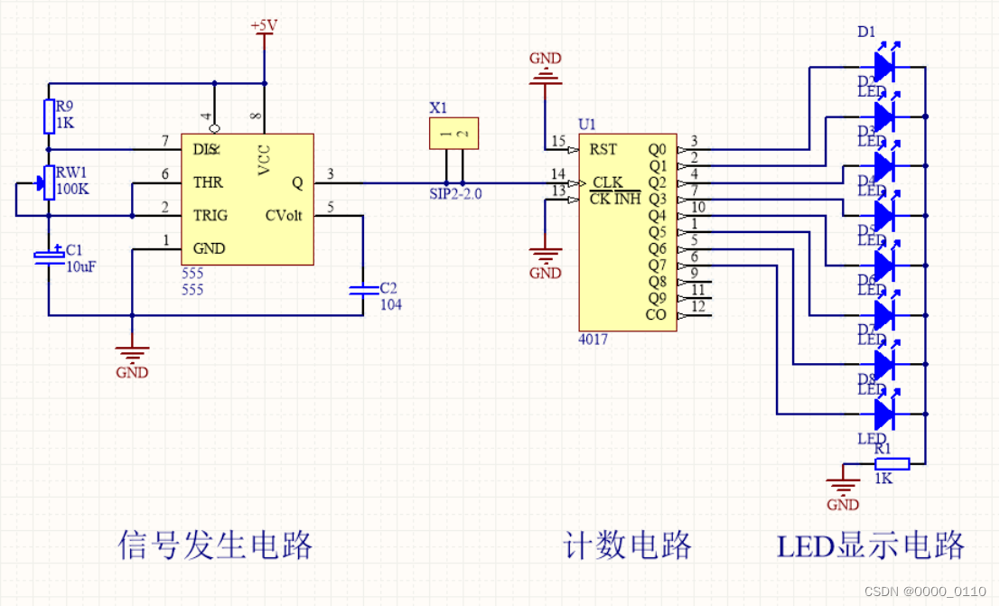
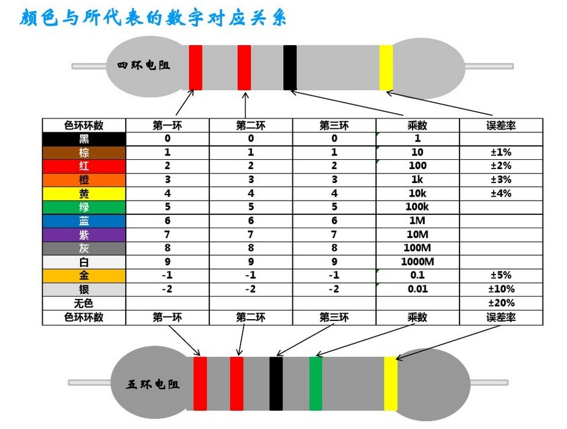
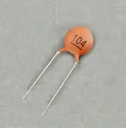
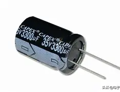
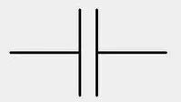

# 第一天 · 初识流水灯与基础元件（上）

> **今日目标**：看懂总体原理图，知道这个电路由几大块组成、每块干什么，然后认识电阻和电容两种最基础的元件。
>
> **预计时间**：2~3 小时

---

## 1. 先看成品：我们要做的东西长这样

> 📌 **先看图，再看字。** 看不懂没关系，有个印象就行——今天的目标就是让你从"完全不知道"变成"大概知道"。

### 1.1 总体原理框图



> 上图是整个流水灯电路的**模块级原理图**。一眼看过去就三块：
>
> ```
>   电源(5V)
>     │
>     ├──→ NE555时钟电路 ──→ CD4017计数器 ──→ 10路LED
>     │       ↓                    ↓
>     │   产生方波脉冲         依次点亮Q0~Q9
> ```

**一句话记住这张图**：NE555 定节奏，CD4017 走位置。没有 NE555 的方波输出，CD4017 不计数、LED 全灭。

### 1.2 做出来以后是什么效果？


> 上电后，10个LED灯依次循环点亮，像水一样流动——这就是"流水灯"。

电路的核心是两个经典芯片：

| 芯片 | 功能 |
|------|---------------|
| NE555 | 产生方波时钟信号——像心脏一样为整个电路提供规律的节拍 |
| CD4017 | 十进制计数器——每收到一个节拍，就把10个输出脚依次拉高 |

它们都是 DIP 封装（两排引脚插进焊盘孔里），焊接友好，非常适合入门。

### 1.3 你将学到什么（5天+焊接日总览）

| 天数 | 内容 | 干啥 |
|:---:|------|------|
| Day 1 | 总体原理 + 电阻 + 电容 | 认识元件，看懂框图 |
| Day 2 | LED + 二极管 + IC + 数据手册 | 认完剩余元件，学会查芯片说明书 |
| Day 3 | 电路原理详解 | 逐块搞懂每个元件怎么接、为什么这么接 |
| Day 4 | 立创EDA实战 | 亲手画原理图、画PCB |
| Day 5 | 打样下单 + 拓展 | 下单、等板、深入原理 |
| 🔧 焊接日 | 焊接调试 + 合影 | 板子到了，焊起来！ |

> 💡 **今天只做一件事：把上面那个框图看懂，认识电阻和电容。** 其他内容后面几天慢慢来。

---

## 2. 关键术语速查表

> 以下术语贯穿整个PCB设计过程。现在先通读一遍有个印象，后面每用到一个就回来对照——不用死记。

| 术语 | 一句话解释 | 在哪一步用到 |
|------|-----------|:----------:|
| **原理图（Schematic）** | 电路的逻辑连接图——表示"谁和谁连在一起"，不关心物理位置 | 画原理图时 |
| **网表（Netlist）** | 原理图到PCB的"桥梁"——描述所有元件和连接关系的列表 | 原理图转PCB时 |
| **网络（Net）** | 原理图中电气连通的一组节点。VCC、GND、每根导线都是一个网络 | 画原理图时 |
| **封装（Footprint）** | 元件在PCB上的物理"脚印"——焊盘位置、引脚间距、外形尺寸 | 原理图中给元件绑定封装时 |
| **焊盘（Pad）** | PCB上焊接元件的金属接触点。插件焊盘=孔+环，贴片焊盘=表面铜块 | PCB布局时 |
| **丝印（Overlay）** | PCB表面的白色字符层——标位号(R1/C1)、极性、版本号。无电气功能 | PCB收尾时 |
| **阻焊（Solder Mask）** | PCB表面的绿色油墨——覆盖不需要焊接的铜箔，焊盘处"开窗"露铜 | 工厂制板 |
| **过孔（Via）** | 从顶层钻到底层的导电孔，孔壁镀铜，用来连接不同层的走线 | PCB布线时 |
| **铺铜（Copper Pour）** | 在PCB上大面积覆盖铜皮（通常接GND）——减少地线阻抗、散热 | PCB收尾时 |
| **飞线/鼠线（Ratsnest）** | 原理图转PCB后元件之间的细线——提示"这两个焊盘需要连通"，不是实际走线 | PCB布局时参考 |
| **DRC** | 设计规则检查——自动检查走线宽度/间距/过孔是否违反制造约束 | PCB完成后、导出前 |
| **ERC** | 电气规则检查——自动检查原理图有没有悬空引脚、短路等逻辑错误 | 原理图完成后 |
| **Gerber** | PCB工厂生产用的标准文件格式——每个层一个文件 | 导出下单时 |

> 💡 **三个最容易被新手混淆的概念**：
> - **丝印 ≠ 铜** — 丝印是印上去的白色字，不导电；走线是铜，导电
> - **飞线 ≠ 走线** — 飞线是提示"该连"，走线是你画上去的铜；布线完成=所有飞线消失
> - **阻焊 ≠ 铜** — 阻焊是盖在铜上面的绿色油墨；焊盘处阻焊"开窗"露出铜才能焊

---

## 3. 认识基础元件：电阻（Resistor）

> 从这一节开始，我们要一个一个认识电路板上会出现的元件。**每个元件都要搞清楚三件事：长什么样？有什么关键参数？在电路里干什么？**

### 3.1 实物长什么样？

插件电阻是一个圆柱体，两头有金属引脚，身上有4条（或5条）彩色环。



> 🔗 色环可以直接读出阻值，但日常焊接我们推荐直接用万用表量——更快更准。好奇色环怎么读的，见文末 **[附录：插件电阻色环读法](#附录插件电阻色环读法)**。

### 3.2 电阻的三个关键参数

| 参数 | 含义 | 本项目选型 |
|------|------|-----------|
| **阻值** | 电阻的大小，单位Ω（欧姆） | LED限流：**1kΩ**；NE555定时：1kΩ~100kΩ |
| **功率** | 能承受多大的电流发热而不烧毁 | 全部用 **1/4W（0.25W）**，最通用的插件电阻 |
| **精度** | 实际阻值与标称值的偏差 | 普通用±5%（金环），要求高的用±1%（棕环） |

### 3.3 电阻为什么发热？—— 功率是怎么回事

电流通过电阻时，电子与导体原子不断碰撞，把电能转化为热能。**电功率的定义**（适用于任何元件）：

$$P = V \times I$$

> P：功率（W，瓦特）&nbsp;&nbsp;|&nbsp;&nbsp;V：元件两端的电压（V）&nbsp;&nbsp;|&nbsp;&nbsp;I：流过元件的电流（A）

对于电阻，欧姆定律把 V 和 I 绑定了（V = I × R），代入得到：

$$P = I^2 R \quad\text{或}\quad P = \frac{V^2}{R}$$

> 📝 **本项目例子**：LED限流电阻 1kΩ，红色LED压降约1.8V，电阻两端电压 = 5V - 1.8V = 3.2V。
>
> 实际电流：I = 3.2V ÷ 1000Ω = 0.0032A = 3.2mA
>
> 电阻功耗：P = I²R = (0.0032)² × 1000 = **0.010W** ← 远小于 0.25W，放心用。

### 3.4 功率裕量（降额）—— 永远别让电阻"满负荷"跑

电阻的标称功率是在 **25°C 理想条件** 下测的。现实中条件没这么理想——所以**必须留余量**。

**规则：实际功耗 ≤ 额定功率 × 70%**（推荐值）。

| 降额系数 | 适用场景 |
|:---:|------|
| **70%** | 🏠 一般情况，推荐 |
| **80%** | ⚡ 极限一些，可以接受 |
| **50%~60%** | 🛡️ 手头宽裕 / 高可靠场合 |

> **常见功率等级（插件）**：1/8W → 1/4W（最常见）→ 1/2W → 1W → 2W → 3W → 5W
>
> 功率越大，体积越大——**大体积 = 大表面积 = 更好的散热**。

> 💡 **一句话**：算出实际功耗后，除以0.7，然后往上取最近的标准功率等级。

### 3.5 常用阻值速查表（E24系列）

```
10  12  15  18  22  27  33  39  47  56  68  82
100 120 150 180 220 270 330 390 470 560 680 820
1k  1.2k 1.5k 1.8k 2.2k 2.7k 3.3k 3.9k 4.7k 5.6k 6.8k 8.2k
10k 12k 15k 18k 22k 27k 33k 39k 47k 56k 68k 82k
100k 120k 150k 180k 220k 270k 330k 390k 470k 560k 680k 820k
1M
```

> 挑这些阻值就够用了——其他的要么不常见，要么可以用串并联拼出来。

**在立创EDA原理图中**：电阻的符号是一个长方形（美国标准），旁边标注 "R?" 和阻值如 "1k"。


### 3.6 🤔 思考题：手上没有合适功率的电阻怎么办？

> **场景**：5V 供电，负载 4Ω，需要串联一个限流电阻把电流限制在 0.25A。
>
> 自己算一下：
> - 限流电阻应该多大？__________
> - 这个电阻承受多大功率？__________
> - 该选多大功率的电阻？__________
>
> 现在翻遍元件盒，**只有 1/4W 的 1kΩ 电阻**。单颗 1kΩ 阻值不对，1/4W 功率也不够。
>
> **怎么用这些 1kΩ 1/4W 电阻，通过串并联组合，同时满足 阻值 ≈ 计算值 且 每颗都不超功率裕量？**
>
> 🔗 答案见文末 **[附录：思考题答案](#附录思考题答案--电阻串并联解决功率不足)**。**先自己试试，再看答案。**

### 3.7 选读：电阻功率选型实例

> 以下内容供想深入的同学参考，**不作为今日硬性要求**。

**场景**：某电机驱动电路中有一个 **10Ω 电流采样电阻**，流过电流 **0.5A**。该选多大功率？

- 实际功耗：P = I²R = (0.5)² × 10 = **2.5W**
- 按70%降额：2.5W ÷ 0.7 ≈ 3.57W → 往上取 **5W**
- ❌ 不能选3W（2.5÷3=83%，超了80%这条线）
- ❌ 不能选2W（直接超额定功率）

---

## 4. 认识基础元件：电容（Capacitor）

### 4.1 实物长什么样？

插件电容分两大类：

| 类型 | 外观 | 特点 |
|------|------|------|
| **瓷片电容**（陶瓷电容） | 扁圆形小圆片，土黄色或蓝色 | 无极性，容量小（pF~0.1μF），高频特性好 |
| **电解电容** | 圆柱体带塑料外皮，顶部有十字刻痕 | **有极性（分正负极！）**，容量大（1μF~几千μF） |




- 瓷片电容两脚一样长，不分正负。
- 电解电容：**长脚=正极**，外壳上负极一侧有白色条纹上印着 "-"。

### 4.2 电容的三个关键参数

| 参数 | 含义 | 本项目选型 |
|------|------|-----------|
| **容量** | 储存电荷的能力，单位F（法拉），常用μF、nF、pF | 0.01μF（瓷片）、10μF/100μF（电解） |
| **耐压** | 电容能承受的最高电压，超过会击穿甚至**爆炸** | 瓷片：50V够用；电解：**16V或25V** |
| **类型** | 瓷片/电解/钽/独石/CBB等 | 我们只用瓷片和电解 |

### 4.3 容量标识方法

- **瓷片电容**：通常印三位数字，如 "104" = 10 × 10⁴ pF = 100,000 pF = **0.1μF**
  - "103" = 0.01μF，"102" = 1nF，"471" = 470pF
- **电解电容**：直接印在侧面，如 "100μF 25V"

> 💡 瓷片电容上的数字怎么读？看上面实物照片——"104" = 10 × 10⁴ pF = 0.1μF。标识就在电容身上，照片里能看到。

### 4.4 耐压裕量（降额）—— 电容比电阻更需要留余量！

| 元件 | 超限后果 |
|------|------|
| 电阻过功率 | 发热 → 烧断 → 开路（通常不危险） |
| 电容过压 | 击穿 → **短路**（瓷片）或 **爆炸/起火**（电解/钽）|

**降额规则**：

| 电容类型 | 推荐降额 | 极限 | 说明 |
|------|:---:|:---:|------|
| **瓷片 / MLCC** | 70% | 80% | 过压后短路，低压电路中后果相对可控 |
| **电解电容** | 60%~70% | 80% | 电解老化后耐压会下降，过压失效可能炸开 |
| **钽电容** | **≤50%** | — | ⚠️ 过压失效=短路+起火，**必须严格降额** |

> 💡 5V供电选16V耐压 → 5÷16≈31%，安全。这就是"耐压选1.5~2倍"的由来。

### 4.5 💥 一个小故事

> 曾经有人（别问是谁）在 24V 电源板上手滑装了一颗耐压 **10V** 的电解电容。上电几秒后——**"嘭！"**——声音堪比火柴炮。电容的铝壳像子弹一样飞出去，里面卷绕的铝箔和电解液纸屑炸得满桌子都是。
>
> 那颗电容的规格是 **10V / 380μF**。24V 加在 10V 耐压上——超了 2.4 倍，电解液瞬间沸腾气化，内部压力直接把铝壳顶飞。


> **教训**：电解电容的耐压不是"建议值"——是生存底线。超了就炸，没有商量的余地。

> ⚠️ **电解电容极性绝对不能反**——反接会发热、鼓包、甚至炸开（顶部十字刻痕就是泄压用的）。

**常见耐压等级**：6.3V → 10V → 16V → 25V → 35V → 50V → 63V → 100V

**在立创EDA原理图中**：无极性电容是两条平行线，有极性电解电容一侧是直线（正极）一侧是弧线。



---

## 📌 今日小结

| 你学会了 | 具体内容 |
|----------|---------|
| 看懂总体框图 | 电源 → NE555（心跳）→ CD4017（走位）→ 10个LED |
| 认识电阻 | 阻值、功率（1/4W）、降额70%、常用阻值表 |
| 认识电容 | 瓷片（无极性、小容量）vs 电解（有极性、大容量）、耐压降额 |

> 💡 今天的内容如果消化了80%，明天继续学 LED、二极管和 IC 芯片就会很轻松。**元件是乐高积木——先认清楚每一块，后面搭起来就快了。**

---

## 🎯 拓展延伸：NE555 —— 一颗活了50年的芯片

> 以下内容纯属聊天，不考试。

你今天在框图上看到的那颗 NE555，是一颗**1972年**就诞生的芯片——比你爸妈年龄都大。

它由瑞士工程师 Hans Camenzind 设计，当时他在一家叫 Signetics 的小公司工作。老板让他设计一个"能当定时器用的芯片"，他就一个人花了几个月搞出来了。

结果呢？这颗小小的8脚芯片成了**史上销量最高的IC之一**——到今天每年仍有超过 **10亿颗** 被生产出来。从玩具到航天器，从电子琴到医疗设备，到处都有它的身影。

为什么它能活这么久？三个字：**简单、皮实、便宜**。
- 只要 3 个外围元件就能工作
- 电压范围宽（4.5V~16V），随便一个电源就能跑
- 一颗几毛钱，炸了也不心疼

> 🎸 顺带一提：NE555 的方波输出如果频率调到音频范围（20Hz~20kHz），接上扬声器就能当简易电子琴。有人用 555 做过吉他效果器、合成器，甚至整张电子音乐专辑。你可以试试把 R2 换成可调电阻（电位器），拧一拧——流水灯就变成了"变频灯"，闪烁频率随你拧。

**明天预告**：LED为什么能发光？二极管是干什么的？IC芯片（NE555和CD4017）的引脚怎么看？我们继续认元件。

---

## 附录：思考题答案 — 电阻串并联解决功率不足

> 这是 §3.6 思考题的答案。**建议先自己尝试计算，再来看答案。**

### 第一步：算清楚需要什么

你在调一个电路：**5V 供电**，负载是一个 **4Ω** 的小电机（或大功率 LED 阵列），直接接 5V 的话电流高达 5V÷4Ω=1.25A，电机会烧。你需要串联一个限流电阻把电流限制在 **0.25A**。

**计算所需的限流电阻：**

$$R_{总} = \frac{5\text{V}}{0.25\text{A}} = 20\Omega$$

$$R_{限流} = R_{总} - R_{负载} = 20\Omega - 4\Omega = 16\Omega$$

**这个电阻承受的功率：**

$$P = I^2 R = (0.25\text{A})^2 \times 16\Omega = 0.0625 \times 16 = 1\text{W}$$

> 结论：你需要一颗 **16Ω / 1W** 的电阻。按 70% 降额，需要选 **2W**（1W÷0.7≈1.43W → 往上取 2W）。

### 第二步：盘点手头的资源

翻遍元件盒，只有一包 **1/4W（0.25W）的 1kΩ 电阻**。

| 你需要的 | 你手头的 | 差距 |
|------|------|------|
| 16Ω | 1kΩ | 阻值差了约 60 倍 |
| / | 1/4W | 功率差了 4~8 倍 |

单颗 1kΩ 1/4W 既阻值不对、功率也不够。

### 第三步：核心思路

两个目标同时达成：
1. **阻值要对**：用串并联把 1kΩ 变成 ≈16Ω
2. **功率要分摊**：让每颗电阻只承受总功率的一小部分，不超过 1/4W（还要留裕量！）

### 第四步：方案 — 纯并联

把 N 颗相同的 1kΩ 电阻并联：

$$R_{等效} = \frac{1\text{k}\Omega}{N}$$

要得到 16Ω：

$$N = \frac{1000}{16} \approx 62.5 \quad\rightarrow\quad \text{取 } N = 63$$

> 63 颗 1kΩ 并联 → 等效电阻 = 1000 ÷ 63 ≈ **15.87Ω**，非常接近 16Ω。

**验算功率分配：**

并联电路中，每颗电阻两端电压相同，电流均分：

- 总电流：0.25A
- 每颗电流：0.25A ÷ 63 ≈ 0.00397A ≈ **4mA**
- 每颗功率：P = I²R = (0.004)² × 1000 ≈ 0.016W

| 检查项 | 数值 | 判定 |
|------|------|:---:|
| 每颗电阻实际功耗 | ≈ 0.016W | — |
| 1/4W 额定功率 × 70% 降额 | 0.175W | — |
| 0.016W ≤ 0.175W？ | — | ✅ 裕量充足（只用到了额定功率的 6.4%） |
| 等效阻值 15.87Ω ≈ 16Ω？ | 误差 < 1% | ✅ |

**实际电流会略微偏大**：5V ÷ (4Ω + 15.87Ω) ≈ 0.252A，比目标 0.25A 多了不到 1%，完全可以接受。

### 方案示意图

```
  5V ──┬── R1(1kΩ) ──┬── R2(1kΩ) ──┬── … ──┬── R63(1kΩ) ──┬── 负载(4Ω) ── GND
       │              │              │        │              │
       └──────────────┴──────────────┴────────┴──────────────┘
                       63颗1kΩ全部并联
```

### 核心原则

> 🧠 **功率不够就分摊，阻值不对就组合，但每颗都不能超限。**

这个原则在真实工程中随处可见：

| 场景 | 怎么用 |
|------|------|
| 🔌 **电源电路的电流采样** | 用 2~4 颗相同电阻并联，既降低等效阻值又分摊功率，比买一颗大功率电阻便宜 |
| 🏭 **大功率负载（如假负载/放电电阻）** | 用几十颗电阻串并联阵列——每颗只承受一小部分功率，散热面积大、可靠性高 |
| ⚡ **LED 均流** | 多颗 LED 并联时，每路串一颗电阻——既限流又保证各路电流均匀 |
| 🛠️ **手焊调试** | 发现某颗电阻发烫，手头没有更大功率的 → 并一颗同样阻值的上去，每颗功耗直接砍半 |

> 💡 回到这个具体场景——最简单的做法还是直接买一颗 **16Ω / 2W** 的电阻（几毛钱）。但万一你半夜调电路、立创商城还没发货、第二天就要答辩——现在你知道怎么用 1kΩ 1/4W 硬扛过去了。虽然焊 63 颗很蠢，但电路能跑，比干等着强。

---

## 附录：插件电阻色环读法

> 本节是 §3.1 的延伸，给对色环好奇的同学参考。**不是必读**——日常焊接用万用表更快更准。
>
> ⚠️ 科技在进步，时代在发展——色环这玩意儿记了也用不上，考试也不考。真需要用的时候拿手机查一下就行。**实在无计可施的时候**（比如整包标签丢了、散落一地分不清了），才用色环分辨。

### 色环颜色对照表

插件电阻用身上的彩色环标注阻值，常见的有 **4环**（普通精度）和 **5环**（高精度）两种：


| 颜色 | 数字 | 乘数 | 误差 |
|------|:---:|:---:|:---:|
| 黑 | 0 | ×1 | — |
| 棕 | 1 | ×10 | ±1% |
| 红 | 2 | ×100 | ±2% |
| 橙 | 3 | ×1k | — |
| 黄 | 4 | ×10k | — |
| 绿 | 5 | ×100k | ±0.5% |
| 蓝 | 6 | ×1M | ±0.25% |
| 紫 | 7 | ×10M | ±0.1% |
| 灰 | 8 | — | — |
| 白 | 9 | — | — |
| 金 | — | ×0.1 | ±5% |
| 银 | — | ×0.01 | ±10% |

### 4环电阻读法

```
   ┌─────────────────┐
───┤ 环1  环2  环3  环4 ├───
   └─────────────────┘
      ↓    ↓    ↓    ↓
    数字1 数字2 乘数  误差
```

- **环1、环2**：有效数字（查上表"数字"列）
- **环3**：乘数（在数字后面加几个零）
- **环4**：误差（金=±5%，银=±10%）

> **例**：棕-黑-红-**金** → 1, 0, ×100, ±5% → 1000Ω = **1kΩ ±5%**
>
> **例**：黄-紫-橙-**金** → 4, 7, ×1k, ±5% → 47000Ω = **47kΩ ±5%**

### 5环电阻读法

```
   ┌──────────────────────┐
───┤ 环1  环2  环3  环4  环5 ├───
   └──────────────────────┘
      ↓    ↓    ↓    ↓    ↓
    数字1 数字2 数字3 乘数  误差
```

前**三**环是有效数字，第四环是乘数，第五环是误差（棕=±1%最常见）。

> **例**：棕-黑-黑-红-**棕** → 1, 0, 0, ×100, ±1% → 10000Ω = **10kΩ ±1%**

### 怎么区分4环还是5环？

数环数。如果误差环是金色或银色 → 4环（金/银永远在最后一环）。如果第五环是棕色 → 大概率是5环 ±1%。拿不准时用万用表测一下最踏实。

### 实用小技巧

- **第4环（误差）离其他环稍远**，间隙大一点——靠这个判断哪头开始读
- 最常见的误差环颜色：**金（±5%）** 和 **棕（±1%）**
- 如果读出来阻值不在 E24 常用值里（比如算出 13kΩ），很可能是读反了——换个方向试试
- **色环电阻读数App**：手机上有不少免费App，对着电阻拍照就能识别，比人眼靠谱
