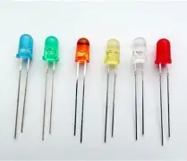
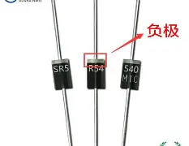
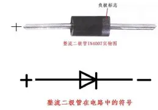
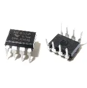
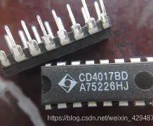

# 第二天 · 基础元件（下）与数据手册

> **今日目标**：认识 LED、二极管、IC 芯片等剩余元件，学会阅读芯片数据手册。
>
> **预计时间**：2~3 小时

---

## 1. 课前回顾：Day 1 我们学了什么

先花 2 分钟回忆一下：

```
电源(5V)
  │
  ├──→ NE555时钟电路 ──→ CD4017计数器 ──→ 10路LED
  │       ↓                    ↓
  │   产生方波脉冲         依次点亮Q0~Q9
```

- **电阻**：限流 + 分压，关键参数是阻值和功率（记得留70%裕量）
- **电容**：储能 + 滤波，瓷片（无极性）和电解（有极性），耐压必须留余量

> 今天把剩下的元件认完，明天就能正式"拆解电路"了。

---

## 2. LED（发光二极管）

### 2.1 实物长什么样？

插件LED是一个透明（或彩色）的小半球，底部两个引脚：**长脚=正极（Anode），短脚=负极（Cathode）**。

从侧面看，LED内部大金属片的一端是**负极**，小金属片是**正极**。



### 2.2 LED的关键参数

| 参数 | 含义 | 本项目值 |
|------|------|---------|
| **颜色** | 发什么光 | 红色（最便宜、压降最低） |
| **正向压降（Vf）** | LED导通时两端的电压 | 红≈1.8~2.0V，绿≈2.2~2.4V，蓝/白≈3.0~3.2V |
| **工作电流（If）** | 建议通过的电流 | 普通LED：20mA(Max)，**1~5mA 亮度就够** |

### 2.3 限流电阻怎么算？

LED **不能直接接电源**——它是二极管，电压超过Vf后电流会急剧增大烧掉。必须串联一个限流电阻：

$$R = \frac{V_{CC} - V_f}{I_f}$$

> 例：5V供电，红色LED（Vf=1.8V），用 1kΩ 限流电阻  
> I = (5 - 1.8) / 1000 = **0.0032A = 3.2mA**——亮度足够，省电又不刺眼
>
> 在 5V 以内的数字电路中，**1kΩ 是 LED 限流电阻的通用取值**——不用每次算，拿一颗 1kΩ 焊上去就行。

> 💡 为什么是 1kΩ？除了计算合适外，还因为 1kΩ、4.7kΩ、10kΩ 这几个值是焊接取料时最随手可及的——用的人多，元件盒里永远有。

**在立创EDA原理图中**：LED符号是三角形箭头+横线，带两个向外箭头表示发光。


---

## 3. 二极管（Diode）

### 3.1 实物长什么样？

插件二极管最常见的是：

| 型号 | 类型 | 外观 | 特点 |
|------|------|------|------|
| **1N4148** | 小信号开关二极管 | 红色玻璃封装，很小 | 高速开关用 |
| **1N4007** | 整流二极管 | 黑色塑料封装，较粗 | 耐压1000V、电流1A |


二极管有极性：圆柱体一端有一圈**色环（通常黑色或白色），色环端 = 负极（Cathode）**。



### 3.2 二极管的关键参数

| 参数 | 含义 |
|------|------|
| **正向压降** | 导通时电压降：硅管≈0.7V，肖特基≈0.3V |
| **反向耐压** | 反向不导通时能承受的最大电压 |
| **最大正向电流** | 能持续通过的最大电流 |

> 💡 LED 本质上也是一种二极管——只不过它会发光。所以 LED 的符号和普通二极管几乎一样，只是多了两个发光箭头。

**在立创EDA原理图中**：符号和LED一样是三角形箭头+横线，但**没有**发光箭头。



---

## 4. IC 芯片与IC座

### 4.1 实物长什么样？

NE555 和 CD4017 都是 **DIP（Dual Inline Package，双列直插）** 封装——黑色塑料方块，两侧各一排引脚。

| 芯片 | 封装 | 引脚数 |
|------|------|--------|
| NE555 | DIP-8 | 8脚 |
| CD4017 | DIP-16 | 16脚 |




### 4.2 引脚编号规则

芯片正面（有字那面）朝上，缺口朝左，**左下角为1脚，逆时针数**。有些芯片在1脚旁有个小圆点标记。

### 4.3 IC座（芯片座）

**强烈建议焊接时先焊IC座，再把芯片插进IC座**——理由：

- 直接焊芯片，烙铁高温可能烫坏芯片
- 芯片坏了要拆焊很麻烦，有IC座直接拔下来换
- 调试时可以把芯片拔下来单独测试

IC座也分 DIP-8 和 DIP-16，买和芯片匹配的。

---

## 5. 其他插件元件速览

| 元件 | 用途 | 备注 |
|------|------|------|
| **排针** | 引出电源、信号，方便接杜邦线 | 间距2.54mm，一排方头金属针 |
| **排母** | 排针的"插座" | 对接排针，做可插拔连接 |
| **轻触按键** | 复位、模式切换 | 方形小按键，四个脚（内部两两连通） |
| **拨动开关** | 电源开关 | 常见3脚，中间公共、两边选通 |
| **DC电源插座** | 外接直流电源适配器 | 圆孔，外径5.5mm内径2.1mm |

**在立创EDA原理图中**：排针用 "排针 1×N" 或单个排针符号拼接；按键用常开触点的按键符号。

---

## 6. 如何阅读芯片数据手册（Datasheet）

> 学到这里，你第一次面对"芯片"这个黑盒子。NE555 和 CD4017 怎么用？哪个脚接电源？典型电路长什么样？——这些问题的答案都在**数据手册（Datasheet）**里。

数据手册是芯片厂商写的"使用说明书"。第一次看会觉得厚（几十到几百页），但**不需要全读**。只需要定位以下几个关键章节：

| # | 章节 | 找什么 | 重要性 |
|---|------|--------|:------:|
| ① | **Pin Description（引脚定义）** | 每个引脚的名字、功能、类型。**拿到芯片第一个看** | ⭐⭐⭐ |
| ② | **Typical Application（典型应用电路）** | 厂商给出的参考电路图。**直接照着画** | ⭐⭐⭐ |
| ③ | **Absolute Maximum Ratings（绝对最大值）** | 电压/电流/温度的极限。**超过任何一个，芯片永久损坏** | ⭐⭐⭐ |
| ④ | **Recommended Operating Conditions（推荐工作条件）** | 正常工作需要的电压、温度、频率范围 | ⭐⭐⭐ |
| ⑤ | **Electrical Characteristics（电气特性）** | 输出高/低电平、驱动能力、功耗 | ⭐⭐ |
| ⑥ | **Package Information（封装尺寸）** | 物理尺寸图：引脚间距、本体长宽 | ⭐⭐（初学者不用自己画） |
| ⑦ | **Functional Description（功能说明）** | 芯片内部怎么工作的 | ⭐（进阶再读） |

### 🔥 实战练习

**请现在下载 NE555 和 CD4017 的数据手册，做以下练习：**

1. 打开 NE555 的数据手册，找到 **Pin Description**——看能不能对照引脚名称猜出每个脚是干什么的
2. 找到 **Typical Application** 中的 "Astable Multivibrator"（多谐振荡器）电路图——这就是我们明天要讲的电路
3. 打开 CD4017 的数据手册，找到它的引脚定义和时序图——看 Q0~Q9 依次变高的波形图

> 💡 **习惯养成**：以后每接触一个你没用过的芯片，第一件事就是下载它的数据手册，定位上面 7 个章节。10分钟就能搞清楚这芯片怎么用——比百度搜"XXX芯片怎么接线"高效且准确。

---

## 📌 今日小结

| 你学会了 | 具体内容 |
|----------|---------|
| 认识 LED | 长脚正、短脚负；必须串限流电阻（1kΩ 通用）；不同颜色Vf不同 |
| 认识二极管 | 色环端=负极；1N4148（小信号）和1N4007（整流） |
| 认识 IC 芯片 | DIP封装、引脚编号规则（左下1脚逆时针）、IC座保护 |
| 阅读数据手册 | 7个关键章节定位法，10分钟上手一个新芯片 |

> 💡 到今天为止，电路板上会出现的所有元件你都认识了。明天我们把这些"乐高积木"拼在一起，逐块讲解电路是怎么工作的。

---

## 🎯 拓展延伸：LED —— 从诺贝尔奖到你手里的发光小珠子

LED 的全称是 **Light Emitting Diode（发光二极管）**——它本质上是一个通电就会发光的 PN 结。

最早的 LED 是 **1962年** 由通用电气公司的 Nick Holonyak 发明的，只能发微弱的**红光**。Holonyak 当时就预言：LED 将来会取代白炽灯泡。当时所有人都觉得他在吹牛——一个米粒大的小红点，怎么取代灯泡？

之后的几十年里，科学家们陆续攻克了绿光、黄光……但**蓝光 LED** 始终做不出来。没有蓝光，就无法合成白光——LED 照明就永远只是个梦。

这个难题困了人类 **30年**。

直到 **1993年**，日本日亚化学的一位研究员——**中村修二**——在无数次失败后，用氮化镓（GaN）材料成功做出了高亮度蓝光 LED。2014年，他和赤崎勇、天野浩一起获得了**诺贝尔物理学奖**。

> 今天你花几分钱买到的那颗小小的红色 LED，背后是几代科学家半个世纪的心血。你手里的流水灯，每条光都是诺贝尔奖的光芒 😄

**明天预告**：电路原理详解——NE555 的三个外围元件怎么决定流水速度？CD4017 怎么做到"十选一"？我们逐块拆解。
