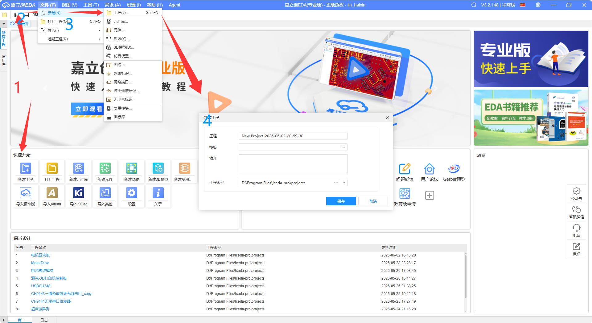
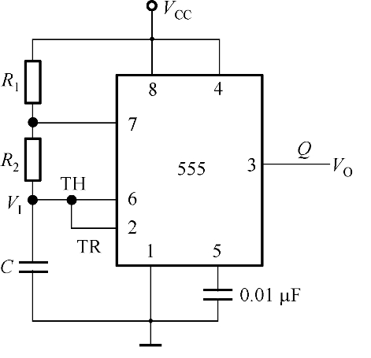
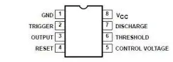
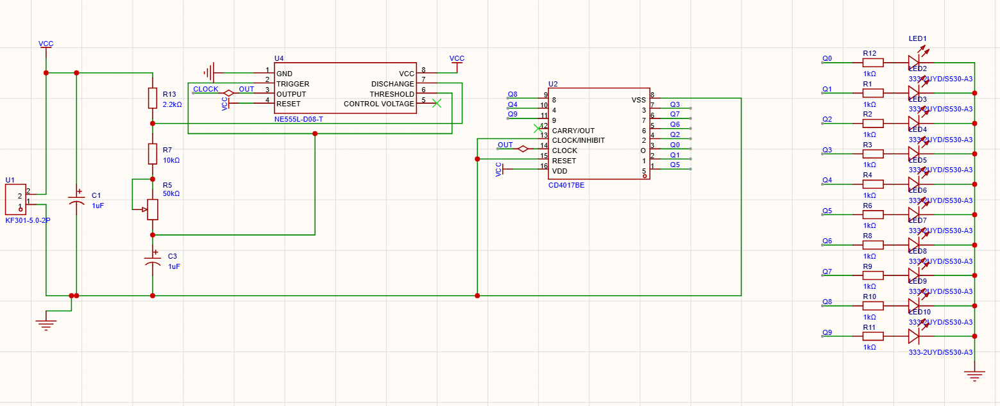

# 第三天 · 电路原理详解 + 原理图绘制

> **今日目标**：逐块搞懂电路原理，同时打开立创EDA把原理图画出来——边学边画，学完就画完。
>
> **预计时间**：2~3 小时
>
> ⚠️ **今天是动手日**——全程在电脑上操作，教程是给你对照着看的。
>
> 💡 立创EDA专业版：`https://pro.lceda.cn/`（网页版直接用，不用安装）

---

## 1. 课前回顾

前两天我们认识了所有元件，也看了总体框图。今天**边学原理边画图**——搞懂一块电路，就在EDA里画出来。

```
电源(5V)
  │
  ├──→ NE555时钟电路 ──→ CD4017计数器 ──→ 10路LED
  │       ↓                    ↓
  │   产生方波脉冲         依次点亮Q0~Q9
```

> **一句话**：NE555 定节奏，CD4017 走位置。

---

## 2. 新建工程，准备画图

在开始学原理之前，先把画布准备好：

1. 打开立创EDA专业版
2. 新建工程 → 命名 `流水灯_NE555`
3. 左侧工程树会出现一个 `.eprj` 工程文件和空白原理图页



> ✅ 画布就位。下面我们逐块学习电路，学一块、画一块。

---

## 3. 第一块：NE555 时钟发生器

### 3.1 它干什么？

NE555 在这里被接成"**多谐振荡器**"模式——说白了就是**自动产生连续的方波**，不需要外部触发。



外围只有 **3个元件**：R1、R2、C。

| 元件 | 接法 | 作用 |
|------|------|------|
| **R1** | VCC 和 DIS脚(7脚) 之间 | 决定电容充电速度 |
| **R2** | DIS脚(7脚) 和 THR/TRIG脚(6脚/2脚) 之间 | 决定电容放电速度 |
| **C** | THR/TRIG脚 和 GND 之间 | 定时电容——充放电的"水池" |

### 3.2 输出频率公式（直接用，先不推导）

$$f = \frac{1.44}{(R_1 + 2R_2) \cdot C_1}$$

> 📝 **举个实际例子**：R1=10kΩ，R2=100kΩ，C1=10μF
>
> f = 1.44 / ((10000 + 2×100000) × 0.00001)
>   = 1.44 / (210000 × 0.00001)
>   ≈ **0.69Hz**
>
> 也就是说 LED 大约每 **1.5秒** 切换一次——肉眼能清晰看到流动效果。

**调整流水速度**：改 R2 或 C1 就行。
- R2 越大 / C1 越大 → 频率越低 → 流水越慢
- R2 越小 / C1 越小 → 频率越高 → 流水越快

### 3.3 NE555 引脚功能速查

> 初学阶段记住"每个脚接什么"就够了，内部原理放在 Day 5 拓展思考。



| 引脚 | 名称 | 本项目接法 |
|:---:|------|-----------|
| 1 | GND | 接地 |
| 2 | TRIG（触发） | 接R2和C1的结点 |
| 3 | OUT（输出） | **去CD4017的CLK脚**——这就是时钟信号 |
| 4 | RESET（复位） | 接VCC（不让他复位） |
| 5 | CTRL（控制电压） | 对地接一个 0.01μF 小电容（防干扰，标准做法） |
| 6 | THR（阈值） | 和2脚短接，一起接R2和C1的结点 |
| 7 | DIS（放电） | 接R1和R2的结点 |
| 8 | VCC | 接5V电源 |

> 💡 今天先把它当黑盒子——知道"输入5V、配3个外围元件、输出方波"就够用了。

### 🖊️ 动手：在EDA中放置NE555和外围元件

**搜索并放置以下元件：**

| 要找的元件 | 搜索关键词 | 选择技巧 |
|-----------|-----------|---------|
| NE555 | `NE555` | 选 **DIP-8** 封装 |
| 电阻 | `RES` 或 `电阻` | 选 "R AXIAL-0.3" 系列 |
| 电解电容 | `电解电容` | 选 "CAP-DIP" 封装，脚距2.54mm |
| 瓷片电容 | `瓷片电容` | 选 "CAP-DIP" 或 "C 插件" |

**操作**：双击搜索结果中的元件 → 光标上粘着元件 → 点击画布放置。

**连线快捷键**：按 **W** 进入连线模式 → 点击起点引脚 → 拖动到终点引脚 → 点击完成。

> 🎯 **把 NE555 + R1/R2/C1/C2 接好**（参照上面的引脚功能表）。两条线交叉处有实心点 = 连接，没有点 = 交叉但不导通。

---

## 4. 第二块：CD4017 十进制计数器

### 4.1 它干什么？

CD4017 是一个"约翰逊计数器"——每收到一个时钟脉冲（上升沿），它的 10 个输出脚（Q0~Q9）就**依次**变成高电平。任何时候**有且仅有一个**输出为高。


### 4.2 关键引脚

| 引脚 | 名称 | 本项目接法 |
|:---:|------|-----------|
| 14 | CLK | 接 NE555 的 OUT（3脚）——每来一个上升沿，输出后移一位 |
| 3,2,4,7,10,1,5,6,9,11 | Q0~Q9 | 输出脚，依次变高，接LED |
| 15 | RST（复位） | 高电平时所有输出清零。本项目不接（或通过电阻接地） |
| 13 | EN（使能） | 低电平允许计数。本项目接地（一直允许） |
| 16 | VCC | 接5V |
| 8 | GND | 接地 |

### 4.3 它是怎么工作的？（简化理解）

想象一个**有10个格子的转盘**，指针初始指向 Q0：

```
上电 → Q0=高（第一个LED亮）
CLK来一个上升沿 → 指针移到Q1（第二个LED亮，第一个灭）
CLK再来一个 → 指针移到Q2（第三个LED亮）
……
移到Q9后再来一个 → 回到Q0（循环）
```

> 这就是"流水灯"三个字的由来——高电平像水一样在10个LED之间"流动"。

### 🖊️ 动手：在EDA中放置CD4017

- 搜索 `CD4017`，选 **DIP-16** 封装（"CD4017BE"是德州仪器的）
- 放置在 NE555 右边
- 用连线把 NE555 的 **OUT（3脚）** 连到 CD4017 的 **CLK（14脚）**

---

## 5. 第三块：LED 驱动

### 5.1 怎么接？

每个 Q 输出脚 → 串一个 **1kΩ** 限流电阻 → 接一个 LED → 到 GND。

```
CD4017 Q0 ──[1kΩ]──▶|── GND    （LED1）
CD4017 Q1 ──[1kΩ]──▶|── GND    （LED2）
    ...        ...       ...
CD4017 Q9 ──[1kΩ]──▶|── GND    （LED10）
```

> 当 Q0 变高（≈5V），LED1 导通发光；当 Q0 变低，LED1 熄灭，同时 Q1 变高，LED2 亮——依次循环。

### 5.2 限流电阻取值

$$R = \frac{5\text{V} - 1.8\text{V}}{3.2\text{mA}} \approx 1\text{k}\Omega$$

> 3.2mA 亮度足够、省电、不刺眼。**1kΩ 是 5V 电路中 LED 限流的通用值。**

### 🖊️ 动手：放置LED和限流电阻

- 搜索 `LED 3mm`，选 "LED-TH-3mm" 红色，放10颗
- 搜索 `RES`，选 1kΩ 电阻，放10颗——每颗串在 Qn 和 LED 之间
- 所有 LED 的负极连到 GND
- 别忘了把 CD4017 的 EN（13脚）接地，RST（15脚）通过电阻接地或悬空

---

## 6. 电源部分

在原理图上加上：
- **VCC**：用排针 `排针 1x2` 引出，正极接 VCC 网络，负极接 GND
- **C3**（100μF 电解电容）：跨接在 VCC 和 GND 之间——这是电源滤波电容
- 可选的 DC 电源插座

---

## 7. 完整原理图 + ERC检查



> 🎯 **对照这张图，试着说出每个元件的名字和作用。** 能从原理图左上角的电源开始，顺着信号流向讲到右下角的 LED——你就出师了。

### ERC检查

菜单 → 设计 → **ERC检查**。ERC会帮你检查：
- 有没有引脚悬空忘了接
- 有没有不该短接的地方短接了
- 电源网络是否正确

**✅ ERC通过 = 原理图没有电气错误。** 有报错就按提示改。

---

## 8. BOM 清单（物料清单）

> BOM = Bill of Materials。这是你去实验室元件库"领料"的清单。

| 序号 | 元件 | 参数/型号 | 封装 | 数量 |
|:---:|------|----------|------|:---:|
| 1 | IC1 | NE555 | DIP-8 | 1 |
| 2 | IC2 | CD4017BE | DIP-16 | 1 |
| 3 | IC座 | 8脚 | DIP-8 | 1 |
| 4 | IC座 | 16脚 | DIP-16 | 1 |
| 5 | R1 | 10kΩ | 插件 1/4W | 1 |
| 6 | R2 | 100kΩ | 插件 1/4W | 1 |
| 7 | R_LED | 1kΩ | 插件 1/4W | 10 |
| 8 | C1 | 10μF 25V | 插件 电解 | 1 |
| 9 | C2 | 0.01μF (103) | 插件 瓷片 | 1 |
| 10 | C3 | 100μF 25V | 插件 电解（电源滤波） | 1 |
| 11 | LED1~10 | 红色 5mm | 插件 LED | 10 |
| 12 | J1 | 排针 1×2 | 插件 2.54mm | 1 |
| 13 | — | DC电源插座 5.5×2.1 | 插件 | 1（可选） |

---

## 📌 今日小结

| 你完成了 | 具体内容 |
|----------|---------|
| NE555时钟 | 多谐振荡器模式、R1/R2/C1三个外围元件、频率公式、引脚接法 |
| CD4017计数 | 10个输出依次变高、"转盘"模型、关键引脚 |
| LED驱动 | 每个Q脚串1kΩ限流电阻 |
| **原理图绘制** | 搜索元件 → 放置 → 连线 → ERC通过 ✅ |
| BOM清单 | 完整物料清单，可以去领料了 |

> 🎉 今天的成果：电路原理搞懂了，原理图也画好了！明天把原理图转成PCB，布局布线，然后直接下单打样。

---

## 🎯 拓展延伸：流水灯的前世今生

你正在做的这个"流水灯"，在电子工程师圈子里有一个更酷的名字——**"LED Chaser"（LED追逐者）**。

它的历史比你想象的久远得多。在集成电路出现之前，工程师们用**继电器**和**真空管**做流水灯——一个简单的10灯循环，需要一整柜的设备。后来有了晶体管，缩小到一个饭盒大小。NE555（1972年）和CD4017（CMOS逻辑系列）的问世，才让"几颗芯片+几颗电阻电容"就能搞定流水灯成为可能。

> 你现在花 5 块钱做的这块板子，50 年前需要一间屋子才能装下。

更酷的是，流水灯的原理被用在了很多你见过的地方：
- 🚗 汽车转向灯（逐颗点亮）
- 🎹 电子琴的节奏指示灯
- 🏮 节日挂的跑马灯
- 🎰 游戏机和弹珠机的灯光效果
- 🎸 著名的"Knight Rider"霹雳游侠车前灯——本质上就是一个来回的流水灯！

> 你做的第一个项目，和好莱坞科幻道具用的是同一个原理 😎

**明天预告**：原理图转PCB，手动布局布线，铺铜，DRC检查，丝印调整，然后一键下单嘉立创！
